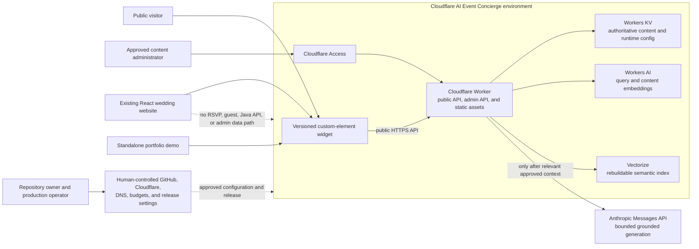
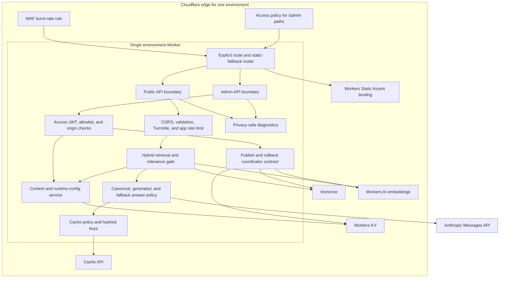
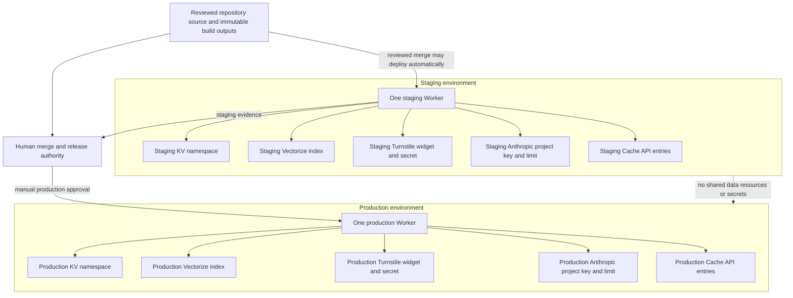
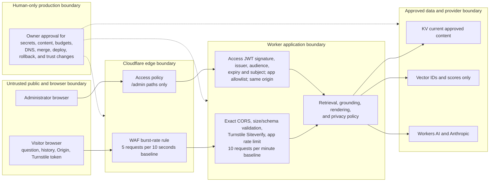
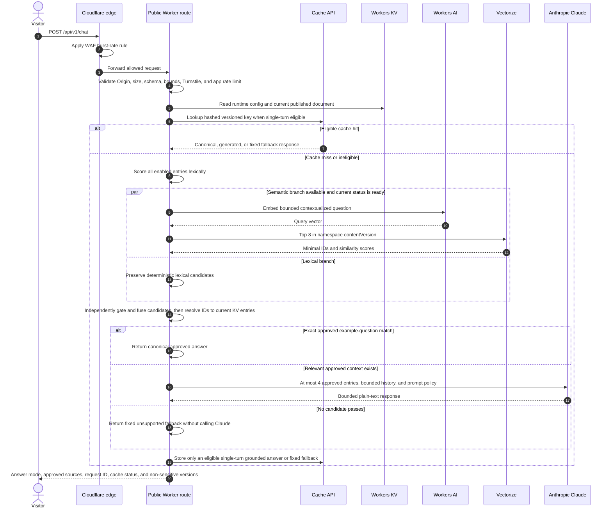
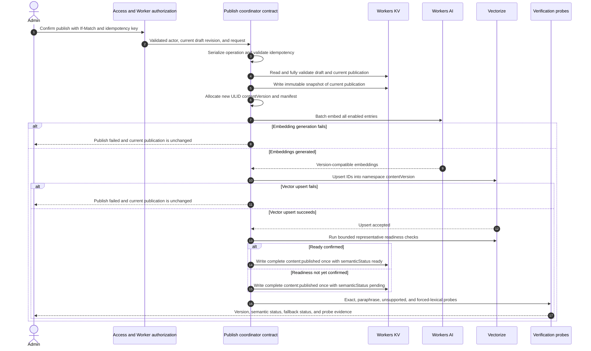
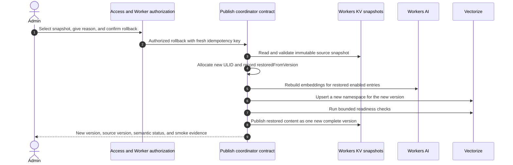
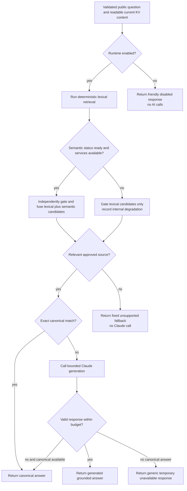

# High-Level Architecture: Cloudflare AI Event Concierge

Status: Proposed for owner approval under [AJA-6](https://linear.app/ajayd94/issue/AJA-6/seed-24-produce-hld-and-architecture-decision-proposals)

## Document control

| Field | Value |
|---|---|
| Product | Cloudflare AI Event Concierge |
| Version | 0.1 proposal |
| Audience | Repository owner, future implementers, security and operations reviewers, prospective clients, and technical reviewers |
| Authority | Review material until the owner approves and merges this document |
| Approved product input | [Product requirements](product-requirements.md), approved through the completed AJA-5 gate |
| Approved planning input | [Master implementation plan](planning/INITIAL_IMPLEMENTATION_PLAN.md) |
| Related governance | [Project charter](PROJECT_CHARTER.md), [design-package inventory](DESIGN_PACKAGE.md), and [human approval policy](HUMAN_APPROVAL_POLICY.md) |

This high-level design (HLD) translates the approved product and planning
baselines into reviewable system boundaries, component responsibilities, trust
boundaries, and failure behavior. It proposes no intentional supersession. The
individual proposed architecture decision records (ADRs) linked below preserve
the baseline and make its material choices independently approvable.

Approval of this proposal authorizes Seed 3 to produce the detailed design and
assurance package. It does not authorize application code, resource creation,
secrets, credentials, billing, DNS, deployment, production content, or release.

## Architecture goals and constraints

The architecture must:

- answer only from relevant, administrator-approved, current-version content;
- return exact canonical answers without Claude when synthesis is unnecessary;
- reject unsupported questions with a fixed fallback and no Claude call;
- keep Workers KV as the readable content authority and Vectorize as a
  rebuildable retrieval index;
- remain useful through deterministic lexical retrieval when semantic services
  are unavailable or not ready;
- give a nontechnical administrator explicit draft, preview, publish, rollback,
  import, export, and runtime-disable workflows;
- deploy one Worker per environment, with staging and production resources kept
  separate;
- serve the public API, admin API, versioned widget, admin single-page
  application (SPA), and standalone demo from that environment's Worker;
- keep Cloudflare Workers and the other eligible Cloudflare services within
  Free-plan allowances, with bounded Anthropic usage as the only expected
  variable operating cost;
- protect public and admin paths with independent, layered controls;
- expose operational evidence without storing conversations or sensitive
  content in logs; and
- preserve human authority over design approval, secrets, production settings,
  production content, merge, deployment, rollback execution, and trust-policy
  changes.

The architecture deliberately excludes user accounts, server-side conversation
persistence, private RSVP or guest-data access, file ingestion, voice,
multi-tenancy, D1 as the V1 content authority, autonomous production release,
and coupling to the wedding site's Java API or existing administration system.

## Proposed decision set

| ADR | Decision | Baseline relationship |
|---|---|---|
| [ADR-0002](adr/0002-colocate-worker-and-static-assets.md) | Co-locate APIs and static assets in one Worker per environment. | Preserves D-01 through D-09, R-08, M-01, and API-01 through API-03. |
| [ADR-0003](adr/0003-use-kv-versioned-publications.md) | Use whole-document KV publications and immutable snapshots. | Preserves C-01 through C-14 and U-01 through U-11. |
| [ADR-0004](adr/0004-use-versioned-hybrid-retrieval.md) | Use versioned hybrid retrieval with Vectorize as a rebuildable index. | Preserves V-01 through V-11 and H-01 through H-13. |
| [ADR-0005](adr/0005-bound-grounded-answer-modes-and-cache.md) | Bound grounded answer modes and cache eligible responses in Cache API. | Preserves A-01 through A-12, K-01 through K-06, and H-06 through H-08. |
| [ADR-0006](adr/0006-layer-public-and-admin-controls.md) | Layer public abuse controls and admin authorization controls. | Preserves S-01 through S-18 and the privacy requirements in the PRD. |
| [ADR-0007](adr/0007-isolate-free-plan-environments-and-releases.md) | Isolate environments and keep Free-plan releases human-controlled. | Preserves D-04, D-09, CI-03 through CI-09, O-06, and Q-01 through Q-06. |

ADR-0001 concerns the local Symphony runner, not the deployed product. It
remains accepted and is not changed by this proposal. No ADR in this set
supersedes the approved planning baseline, the approved product requirements,
or another ADR.

## System context

The public widget and demo are clients of a public Worker API. The protected
admin SPA is a client of admin routes on the same Worker origin. The Worker
retrieves authoritative content from KV, uses Workers AI and Vectorize for the
semantic branch, and calls Anthropic only after relevant approved context has
passed the retrieval gate. The existing wedding platform loads the widget but
does not expose its private services or data to the concierge.



### Context boundaries

| Boundary | Rule |
|---|---|
| Public visitor to Worker | Untrusted input crosses exact-origin CORS, body/schema validation, Turnstile, edge rate limiting, and application rate limiting. |
| Admin to Worker | Cloudflare Access blocks unauthenticated traffic; the Worker independently validates the Access JWT, application allowlist, and same-origin mutation policy. |
| Worker to data services | KV supplies readable current content. Vectorize returns only minimal identifiers and scores that are resolved back to KV. |
| Worker to Anthropic | The Worker sends only bounded current-version approved context plus visitor input when generation is necessary. Browsers never receive provider credentials. |
| Concierge to wedding platform | The wedding site hosts the same widget behind a feature flag. There is no route, binding, credential, or data-model connection to private wedding systems. |
| Automation to production | Agents may propose reviewed artifacts and implementation changes but cannot supply secrets, change production state, merge, deploy, or execute rollback. |

## Container and component architecture

One Worker per environment is the deployable unit. Path routing keeps public,
admin, and static responsibilities explicit even though they share a Worker.
Domain modules have typed contracts so later detailed design can test them in
isolation.



### Component responsibilities

| Component | Responsibility | Must not do |
|---|---|---|
| Explicit router | Give API routes precedence and restrict SPA fallback to `/admin` and `/demo` navigation. Serve immutable widget assets from versioned paths. | Treat unknown API paths as SPA content or expose admin assets outside Access policy. |
| Public boundary | Accept only the documented public routes and stable request/error contracts. | Trust browser validation, origins, Turnstile tokens, or request identifiers without server validation. |
| Admin boundary | Expose content, preview, publish, rollback, import/export, and runtime controls only after layered authorization. | Reuse the wedding site's authentication or accept caller-supplied actor identity. |
| Content service | Validate and read complete draft/published documents and runtime configuration from KV. | Treat Vectorize or cache entries as authoritative content. |
| Publish coordinator contract | Serialize the state transition, enforce draft concurrency and idempotency, create snapshots, index a new version, and commit one complete publication. | Use KV alone as proof of strict concurrent idempotency. Seed 3 must select the coordination primitive. |
| Retrieval service | Run deterministic lexical retrieval and the optional semantic branch, independently gate candidates, fuse accepted signals, and resolve selected IDs to current KV content. | Send stale, draft-only, disabled, or vector-metadata content to the answer stage. |
| Answer policy | Choose canonical, generated, fallback, or unavailable behavior and enforce context/output/time bounds. | Call Claude without relevant approved context or render model-provided HTML/links. |
| Cache policy | Hash all behavior-changing inputs and cache only eligible single-turn grounded answers or the fixed unsupported fallback. | Store raw questions in cache URLs, use KV for high-cardinality responses, or cache auth/rate/upstream failures. |
| Diagnostics | Emit approved metadata needed for retrieval, cost, and failure analysis. | Log raw questions, answers, history, tokens, JWTs, emails, IPs, secrets, authorization headers, guest data, or full documents. |

The publish coordinator is a required architectural boundary, but its strict
serialization primitive is intentionally a Seed 3 detailed-design decision.
That handoff is explicit in the approved baseline: KV cannot by itself guarantee
the required concurrent idempotency. Defining the boundary here avoids either
silently weakening the requirement or adding an unapproved storage product.

## Deployment topology

Staging and production use the same logical topology with separate resources
and credentials. Local development uses Wrangler/Miniflare and mock or local
bindings; it does not receive production credentials. Production hostnames and
resource identifiers are supplied later through human-controlled setup.



### Environment resource contract

| Resource | Local | Staging | Production |
|---|---|---|---|
| Worker | Wrangler/Miniflare process | One staging Worker | One production Worker |
| Static assets | Local Vite outputs | Bound to staging Worker | Bound to production Worker |
| KV | Local/emulated namespace | Staging-only namespace | Production-only namespace |
| Vectorize | Mock or designated development index | Staging-only, embedding-versioned index | Production-only, embedding-versioned index |
| Cache | Local/emulated or bypassed | Keys scoped by staging origin and behavior versions | Keys scoped by production origin and behavior versions |
| Turnstile | Approved test/local configuration | Staging sitekey and secret | Production sitekey and secret |
| Anthropic | Mock by default; separately approved development key if needed | Staging project key and low limit | Production project key and human-confirmed limit |
| CORS | Local approved origins only | Exact staging/demo origins | Exact canonical wedding and assistant demo origins; `www` only after verification |
| Rate controls | Deterministic test doubles or local configuration | Staging bindings/rules | Production bindings/rules |

No staging operation can read or mutate production content. Configuration files
contain only reviewed non-secret settings and resource identifiers; secrets are
installed through human-controlled provider mechanisms.

### Static asset and route topology

| Path | Surface | Routing and security behavior |
|---|---|---|
| `/health` | Public no-AI health | Explicit Worker route; checks configuration/content availability without Workers AI, Vectorize, or Anthropic calls. |
| `/api/v1/*` | Public API | Explicit Worker routes; exact CORS, validation, Turnstile, and both rate-limit layers apply as relevant. |
| `/admin/api/v1/*` | Admin API | Explicit Worker routes under the Access-protected `/admin*` policy plus Worker-side JWT, allowlist, and same-origin checks. |
| `/widget/v1/*` | Versioned widget assets | Immutable, cross-site loadable static assets; no SPA fallback. Incompatible contracts use a new major path. |
| `/demo` and `/demo/*` | Standalone public demo | Static SPA navigation fallback only within this prefix; it embeds the same widget artifact. |
| `/admin` and `/admin/*` | Protected admin SPA | Static SPA navigation fallback only within this prefix and behind Access. API paths retain route precedence. |
| Other paths | None | Return the documented not-found behavior; do not fall through to an SPA. |

## Trust boundaries and security controls

Controls are layered because no single edge or application control establishes
the complete public or admin trust decision.



### Trust decisions

| Concern | Control set | Failure posture |
|---|---|---|
| Public origin | Exact per-environment allowlist, correct preflight handling, exact echoed origin, and `Vary: Origin`. | Reject wildcard, missing-required, speculative, or unapproved browser origins. |
| Automated/burst abuse | One free edge WAF burst rule, Turnstile per send, application rate-limit binding, request/context/output bounds, provider limits, and runtime disable. | Friendly generic retry/disabled state; no strict-global-rate claim and no persistent fingerprint. |
| Admin authentication | Access policy plus independent Worker validation of JWT signature, issuer, audience, expiry, and subject. | Fail closed if any claim, key retrieval, or policy check fails. |
| Admin authorization | Application allowlist, derived actor identity, exact same-origin mutation checks, confirmation, ETag/`If-Match`, and idempotency. | Reject unauthorized, stale, cross-origin, or conflicting mutations. |
| Content and prompt injection | Runtime schemas, approved-content boundary, independent relevance gate, explicit untrusted-data delimiters, text-only rendering, and approved links only. | Unsupported fallback or generic unavailable response; never obey content/user instructions that alter system policy. |
| Secrets | No browser exposure or Git storage; least-privilege, environment-specific secrets installed by the owner. | Service remains unconfigured/unavailable rather than accepting guessed or shared credentials. |
| Private data | Fictional/sanitized public content, no private-system integration, point-of-use privacy notice, and restricted logs. | Do not store or expose visitor conversations, identities, guest data, or full documents. |
| Production authority | Human approval gates and three independent kill switches. | Automation stops at review and cannot merge, deploy, change DNS/billing, or execute production rollback. |

## Public request flow

Every chat request passes abuse and validation controls before a cached or newly
computed answer is returned. A cache hit therefore does not bypass Turnstile,
rate limits, origin checks, or request validation.



### Retrieval and answer invariants

1. The Worker reads the current complete published document from KV; an
   incomplete or invalid document is not answer authority.
2. Lexical scoring always remains available when valid published content is
   readable.
3. Semantic results are queried only from the namespace equal to the current
   `contentVersion` and are ignored unless their version and entry IDs resolve
   to enabled entries in that KV document.
4. Lexical and semantic thresholds are independently calibrated from committed
   evaluations. Until calibration is recorded, the relevance gate fails closed.
5. Exact example-question matches receive the approved canonical answer unless
   multiple entries must be synthesized.
6. Claude is called only when at least one relevant current approved entry has
   passed the gate and synthesis is useful. At most four entries reach the
   answer stage.
7. No relevant candidate means the fixed approved fallback and no Claude call.
8. Model text is rendered as plain text. Only administrator-approved HTTPS
   source links from KV are returned.
9. History remains bounded in browser memory, is never stored by the
   application, and makes a request ineligible for response caching.

## Publishing flow and semantic readiness

The complete KV document is the public commit point. Vector upsert must succeed
before that commit point. A bounded readiness check may be inconclusive after a
successful upsert; in that case the content can publish with semantic status
`pending` and public retrieval remains lexical until verification becomes
`ready`. An embedding-generation or vector-upsert failure before the readiness
decision aborts the publish and leaves the current public document unchanged.



The detailed design must specify the coordinator's serialization primitive,
idempotency record lifecycle, recovery after each partial step, and semantic
status update location. Those details must preserve the following HLD rules:

- a retry with the same idempotency key and equivalent validated operation
  returns the original result;
- reuse with a different operation conflicts;
- a stale draft cannot publish;
- the public KV document changes once per successful content version;
- `pending` is permitted only after successful vector upsert and an
  inconclusive bounded readiness check;
- `failed` means semantic retrieval is not usable and forces lexical retrieval;
- the admin sees indexing and forced-lexical smoke evidence; and
- cache keys change with `contentVersion`, so no enumeration or purge of old
  response keys is required for correctness.

KV is eventually consistent. “Immediately available through lexical retrieval”
means a location uses the new document lexically as soon as that complete
version is observed; it is not a claim of simultaneous global visibility.

## Rollback and retention flow

Rollback is a new publish sourced from an immutable snapshot. It never rewrites
`content:published` to an old version identifier, mutates the selected snapshot,
or deletes history.



Retention is asymmetric by design:

- all V1 KV snapshots are retained; the admin UI lists the newest 20 and export
  remains available;
- Vectorize retains the current namespace and four previous content-version
  namespaces; older IDs are deleted asynchronously from snapshot manifests;
- response-cache entries are not authoritative and expire naturally because
  behavior and content versions are part of the key;
- application logs target no more than seven days where provider controls
  permit, with actual provider retention documented later; and
- owner-controlled encrypted backups remain outside this public repository.

## Failure and degradation behavior

The service is best effort. It preserves factual safety and bounded cost before
availability, while keeping the deterministic path usable where possible.



### Failure matrix

| Failure | Public behavior | Admin/operations evidence | No-go behavior |
|---|---|---|---|
| KV current document missing or invalid | Generic unavailable response; no retrieval or Claude call. | Error category, request/version metadata where known, and health degradation without full content. | Do not answer from vectors, cache misses, model knowledge, or draft data. |
| KV returns an older complete version during eventual propagation | Use that internally consistent version and its version-scoped index/cache behavior; later requests converge. | Version identifiers reveal propagation state without content. | Do not combine document and vectors from different versions. |
| Vectorize empty, stale, unavailable, or below threshold | Continue through lexical gate; answer only if lexical relevance passes. | Internal degradation mode and admin semantic status. | Do not expose infrastructure details in the public answer or call Claude without accepted context. |
| Workers AI query embedding fails | Continue through lexical gate. | Provider/error category and forced-lexical evidence. | Do not treat absence of a semantic score as semantic acceptance. |
| Workers AI embedding or vector upsert fails during publish | Fail before public commit; retain current publication. | Actionable admin publish failure with internal category. | Do not publish a version known to have no successfully upserted semantic corpus. |
| Vector readiness remains uncertain after successful upsert | Publish only under the approved bounded-readiness rule with `pending`; use lexical retrieval. | Pending state, bounded-check result, and later verification. | Do not query pending vectors on the public path. |
| Claude timeout, `429`, retryable `5xx`, or malformed/truncated output | One bounded retry only where approved; return an existing exact canonical answer when available, otherwise generic unavailable. | Model, latency, token counts where returned, and error category without prompt content. | Do not show partial/malformed output or fabricate a response. |
| Turnstile failure | Recoverable generic verification message and fresh-token path. | Non-sensitive verification error category. | Do not forward to retrieval or AI. |
| WAF/application rate limit | Friendly retry message. | Aggregate rate-limit metrics. | Do not claim strict global accounting or identify visitors persistently. |
| Access/JWT/allowlist/origin failure | Deny admin access or mutation. | Security event category without raw JWT, email, or authorization header. | Do not fall back to caller-supplied identity or the wedding admin scheme. |
| Runtime disabled | Friendly disabled response with no AI calls. | Current protected admin state. | Do not serve a cached answer while disabled. |
| Cache unavailable | Compute normally subject to all controls. | Cache miss/degradation metadata. | Do not move response caching into high-cardinality KV keys. |

## Response caching

Cache API is an optimization, never an answer authority. Eligible keys hash:

```text
contentVersion + answerModel + embeddingVersion + retrievalVersion + promptVersion + normalizedQuestion
```

Raw questions never appear in cache URLs or logs. Supported canonical/generated
answers use the approved 24-hour baseline TTL; the fixed unsupported fallback
uses one hour. Requests with history, admin responses, validation failures,
rate limits, authentication failures, upstream failures, disabled states, and
other transient errors bypass storage. Occasional duplicate misses are accepted
instead of adding a lock service solely for portfolio traffic.

## Privacy-safe observability

The Worker records only metadata needed to diagnose behavior and control cost:
request ID, Cloudflare request correlation, route, status, latency, response
mode, cache status, current content/retrieval/embedding/prompt versions, selected
entry IDs, bounded score summaries, provider/model identifier, token counts, and
error category. All errors and admin mutations/publish/rollback events are kept,
plus the approved sample of successful public requests, subject to provider
capability and the later logging design.

It never logs raw questions, answers, conversation history, Turnstile tokens,
Access JWTs, emails, IP addresses, API keys, authorization headers, guest data,
or complete draft/published documents. Public diagnostics never expose scores,
internal degradation details, actor metadata, secrets, or provider payloads.

The public widget explains that questions may be sent to an AI provider, should
not contain personal information, and are not stored by the application by
default. The demonstration notice remains persistent on the widget, demo, and
public documentation surfaces.

## Cost and quota architecture

The architectural budget is a constraint, not a claim about current provider
pricing or achieved usage. Provider prices, quotas, included features, model
availability, and Free-plan eligibility are time-sensitive and must be
revalidated against official sources immediately before implementation and
production launch, then quarterly under Q-06.

| Service or resource | Cost/quota control | Behavior at pressure or uncertainty |
|---|---|---|
| Workers and Static Assets | One Worker per environment, bounded request bodies/work, immutable assets, and no Workers Paid upgrade. | Reduce traffic, tighten approved non-breaking controls, or disable the assistant; never auto-upgrade the plan. |
| Workers KV | Whole small documents, explicit writes, no autosave, no same-key write above the approved limit, and no high-cardinality response keys. | Keep the last complete publication; pause publishing if write/consistency behavior cannot meet the contract. |
| Vectorize | One 384-dimension vector per enabled entry, version namespace, top-K 8, and current plus four prior vector versions. | Delete older vector IDs asynchronously; use lexical retrieval if semantic capacity/readiness is unavailable. |
| Workers AI | Batch content embeddings, one bounded query embedding per uncached semantic request, and lexical/canonical paths that avoid unnecessary calls. | Fall back to lexical retrieval; do not block health checks on AI. |
| Cache API | Version-hashed keys and bounded TTLs for eligible requests only. | Accept duplicate computation on cache failure; do not introduce a paid coordination service for cache misses. |
| Turnstile, Access, and rate controls | Per-environment configuration, exact scopes, and the approved free WAF rule assumption. | Revalidate availability before implementation; fail closed rather than remove a required security boundary silently. |
| Anthropic | Canonical and unsupported paths avoid Claude; maximum four entries, bounded history/context, 300 output tokens, 10-second upstream timeout, 15-second request budget, at most one retry, and human-configured project alerts/limit. | At budget or provider pressure, return safe degraded states or disable the assistant. Only the owner may change the budget. |

Normal operation targets no more than USD 5 per month excluding the already
owned domain. Cloudflare services must remain within applicable Free-plan
allowances; only bounded Anthropic usage is expected to incur ordinary variable
cost. This HLD intentionally does not reproduce numeric provider quotas that
could become stale.

## Ownership and human boundaries

| Area | Agent/future implementation responsibility | Human owner responsibility |
|---|---|---|
| Product and architecture | Propose traceable documents, code, tests, and evidence within approved issues. | Approve product scope, HLD, detailed design, ADRs, threat model, and task graph. |
| Content | Implement validation and protected editorial workflows using sanitized fixtures. | Approve production content and administrator identities. |
| Credentials and configuration | Define typed bindings and fail-closed configuration validation without secret values. | Create/install secrets, account/zone/resource identifiers, Access settings, Turnstile settings, budgets, and notifications. |
| Delivery | Produce reviewable branches/PRs and deterministic evidence; stop at Human Review. | Review, merge, authorize staging acceptance, approve/execute production deployment, and mark work Done. |
| Operations | Implement approved health, telemetry, status, and kill-switch contracts. | Change DNS/billing/trust policy, enable the wedding feature flag, execute production rollback, rotate secrets, and decide pause/decommission actions. |

## Detailed-design handoff

Seed 3 must refine, without weakening, these HLD boundaries:

- route modules, middleware order, environment binding schemas, and typed error
  contracts;
- complete KV schemas, ETags, revisions, manifests, snapshot metadata, and
  migration rules;
- the publish coordinator serialization/idempotency primitive and recovery
  state machine;
- semantic-status persistence, readiness polling, vector cleanup, and rebuild
  procedures;
- embedding input construction, contextualized query construction, lexical
  scorer, fusion normalization, calibration artifacts, and prompt contract;
- request/cache key canonicalization and personal-information cache exclusion;
- Access JWT key caching and claim validation, same-origin rules, CORS tables,
  Turnstile contract, rate-limit key derivation, and security headers;
- threat model, privacy/logging policy, cost model, alert behavior, runbooks,
  compatibility/versioning, and evaluation/test strategy; and
- concrete rollback, outage, migration, secret-rotation, CORS, unexpected-spend,
  and decommission procedures.

Owner-supplied identifiers, admin identities, secret values, production content,
actual canonical `www` behavior, notification destinations, and production
approvals remain intentionally unresolved human inputs, not design gaps to fill
with guesses.

## Architecture risks

| Risk | HLD mitigation | Residual decision/evidence |
|---|---|---|
| A plausible but unsupported answer harms credibility or changes event facts. | Independent retrieval gates, exact canonical mode, fixed unsupported fallback, current-KV resolution, bounded grounded generation, and critical-fact/injection evaluations. | Seed 3 calibrates thresholds and prompt/test contracts; release requires measured gates. |
| KV eventual consistency exposes mixed versions. | Whole-document publications, version-scoped vectors/cache keys, and rejection of mismatched vector metadata. | Seed 3 defines read/retry behavior and propagation tests. |
| Publish retry or concurrency creates duplicate/conflicting versions. | Explicit publish coordinator boundary, ETag/`If-Match`, idempotency, and single public commit point. | Seed 3 must approve a serialization primitive; KV alone is insufficient. |
| Edge/provider degradation makes the demo unavailable. | Lexical fallback, canonical mode, generic unavailable states, best-effort expectations, health checks, and three kill switches. | Failure tests and provider-outage runbooks must prove each path. |
| Public traffic exceeds free quotas or creates Anthropic spend. | Cache, canonical/fallback no-Claude paths, strict bounds, two rate layers, alerts/limits, and runtime disable. | Official pricing/quota revalidation and human-confirmed budgets before launch. |
| Admin or public input crosses a trust boundary incorrectly. | Access plus Worker auth, exact origins, Turnstile, runtime validation, text-only rendering, approved links, and no private-system integration. | Seed 3 threat model and negative contract/browser tests. |
| Telemetry becomes a conversation or identity store. | Metadata-only diagnostics and explicit prohibited-field list. | Logging tests and provider-retention review before launch. |
| One Worker broadens blast radius. | Small modules, explicit route precedence, path-specific middleware, Access boundary, isolated environments, feature flag, runtime disable, and Worker rollback. | Contract/integration tests and staged release evidence. |

## Baseline decision coverage

The matrix groups every baseline decision family material to this HLD. Detailed
per-requirement traceability remains in the PRD, while each ADR lists its exact
decision IDs.

| Decision family | HLD interpretation | Primary evidence |
|---|---|---|
| P-01 through P-10 | Reusable sanitized public demo, same widget, English-only best-effort behavior, no private wedding integration. | Goals, system context, boundaries, and failure behavior |
| G-01 through G-14 | Documents are proposals, human gates remain authoritative, and no silent supersession occurs. ADR-0001 is preserved. | Document control, proposed decision set, ownership |
| R-01 through R-13 | One typed Worker system, protected React admin SPA, dependency-light custom element, same-artifact demo, and testable modular boundaries. | Component architecture and static route topology |
| D-01 through D-09 | One Worker per environment, explicit host/path topology, separated resources, reviewed configuration, and Free-only constraint. | Deployment topology and ADR-0002/0007 |
| C-01 through C-14 | Whole valid KV documents are authoritative; snapshots/version/config behavior remains explicit. | Publishing, rollback, and ADR-0003 |
| U-01 through U-11 | Authorized, idempotent, versioned publish/rollback with bounded readiness and smoke evidence. | Publishing and rollback flows |
| V-01 through V-11 | Version-compatible 384-dimension CLS embeddings, content-version namespaces, minimal metadata, top-K 8, and rebuild/migration rules. | Retrieval invariants and ADR-0004 |
| H-01 through H-13 | Deterministic lexical plus semantic retrieval, independent gates, exact canonical behavior, lexical degradation, bounded evidence, and injection resistance. | Public request flow, failure behavior, ADR-0004 |
| A-01 through A-12 | Pinned configurable Haiku baseline, non-streaming temperature-zero bounded output, restricted retry, plain text, and versioned prompt. | Answer invariants, failure matrix, ADR-0005 |
| API-01 through API-12 | Versioned explicit public/admin routes, stable bounded contracts, safe sources/errors, no-AI health, ETags. | Component and route topology |
| K-01 through K-06 | Cache API only, behavior-version hash, bounded TTLs, strict exclusions, no lock service. | Response caching and ADR-0005 |
| S-01 through S-18 | Exact CORS, Access/JWT/allowlist, Turnstile, dual rate limits, headers/rendering/link policy, secrets/privacy, and no private data. | Trust boundaries and ADR-0006 |
| M-01 through M-10 | Same-origin protected admin, explicit save/preview/publish/rollback/import/export/disable workflows. | Components, publishing, rollback, and ownership |
| W-01 through W-10 | Immutable custom element, Shadow DOM boundary, in-memory history, Turnstile UX, accessibility/mobile targets, feature-flagged narrow host integration. | System context and route topology |
| T-01 through T-12 | Unit/integration/contract/evaluation/browser/failure/publishing evidence and safe provider test boundaries remain required. | Risks and detailed-design handoff |
| CI-01 through CI-09 | Reviewed checks, automatic staging only after merge, manually approved production, separate code/content actions, release evidence. | Deployment and ownership |
| O-01 through O-08 | Privacy-safe telemetry, sampling/retention targets, no-AI health, three kill switches, runbooks, and external backups. | Observability, failure behavior, ownership |
| Q-01 through Q-06 | USD 5 target, Free-only Cloudflare constraint, Anthropic limits/alerts, economical answer modes, compact vectors, and scheduled revalidation. | Cost and quota architecture, ADR-0007 |
| F-01 through F-06 | Linkable HLD/ADRs, inspectable diagrams, honest targets/limitations, and no unmeasured portfolio claims. | This document, individual ADRs, and acceptance mapping |

## AJA-6 acceptance-criteria traceability

| Acceptance criterion | Evidence |
|---|---|
| One Worker per environment, separate staging/production resources, Workers Free-only constraint, and static asset topology are explicit. | [Deployment topology](#deployment-topology), [Environment resource contract](#environment-resource-contract), [Static asset and route topology](#static-asset-and-route-topology), [Cost and quota architecture](#cost-and-quota-architecture), ADR-0002, and ADR-0007 |
| KV authority, Vectorize rebuildability/namespaces, hybrid retrieval, exact canonical answers, bounded Claude generation, Cache API, and lexical fallback are represented. | [Container and component architecture](#container-and-component-architecture), [Public request flow](#public-request-flow), [Retrieval and answer invariants](#retrieval-and-answer-invariants), [Response caching](#response-caching), ADR-0003, ADR-0004, and ADR-0005 |
| Admin Access/JWT checks, Turnstile, dual-layer rate limiting, CORS, privacy, and human production boundaries appear in trust diagrams. | [Trust boundaries and security controls](#trust-boundaries-and-security-controls), [Privacy-safe observability](#privacy-safe-observability), [Ownership and human boundaries](#ownership-and-human-boundaries), and ADR-0006 |
| Publishing, semantic readiness, rollback-as-new-version, snapshot/vector retention, and failure behavior are shown. | [Publishing flow and semantic readiness](#publishing-flow-and-semantic-readiness), [Rollback and retention flow](#rollback-and-retention-flow), [Failure and degradation behavior](#failure-and-degradation-behavior), and ADR-0003/0004 |
| ADRs record viable alternatives and do not silently override the approved baseline. | [Proposed decision set](#proposed-decision-set), [Baseline decision coverage](#baseline-decision-coverage), and ADR-0002 through ADR-0007, each with options, consequences, ownership, and explicit supersession fields |
| No application code, cloud resource, secret, deployment, or production state is changed. | [Document control](#document-control), [Ownership and human boundaries](#ownership-and-human-boundaries), and the documentation-only repository diff |
| The PR contains rendered/inspectable diagrams and decision-to-evidence traceability. | Eight Mermaid diagrams in this HLD, this acceptance matrix, the baseline coverage matrix, deterministic Mermaid validation evidence in the PR, and individual linkable ADR files |

## Approval request

The owner is asked to approve this proposed HLD and ADR-0002 through ADR-0007
as the architecture baseline for Seed 3. Approval confirms the system topology,
authority model, trust boundaries, retrieval/generation policy, publish and
rollback semantics, failure posture, environment isolation, and cost controls.
It also confirms that Seed 3 should select the publish coordinator's strict
serialization primitive within the boundary defined here.

Approval does not authorize application code, infrastructure creation, secrets,
production content, DNS or billing changes, merge automation, deployment, or
rollback execution.
