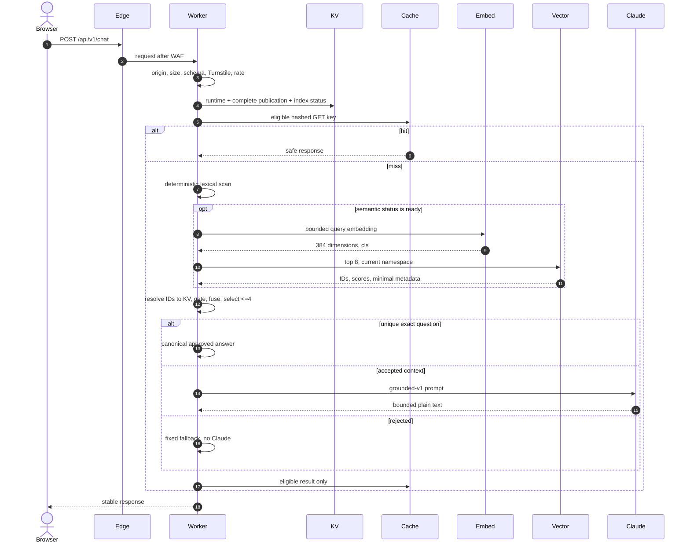
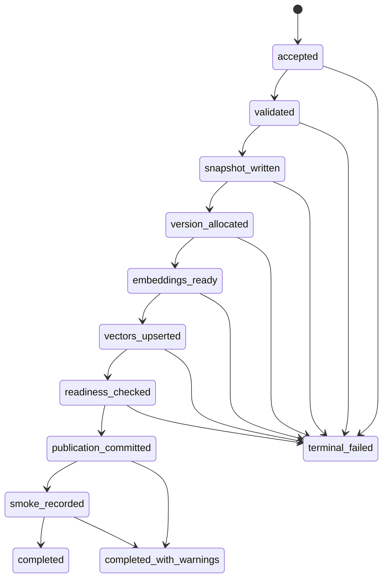

# Detailed Design: Cloudflare AI Event Concierge

Status: Proposed for owner approval under [AJA-7](https://linear.app/ajayd94/issue/AJA-7/seed-34-produce-the-detailed-design-and-assurance-package)

## Document control

| Field | Value |
|---|---|
| Version | 0.1 proposal |
| Authority | Review material until the repository owner approves and merges it |
| Approved inputs | [Product requirements](product-requirements.md), [HLD and ADRs 0002–0007](architecture.md#proposed-decision-set), and the [approved planning baseline](planning/INITIAL_IMPLEMENTATION_PLAN.md) |
| New decision | [ADR-0008: SQLite-backed Durable Object publish coordinator](adr/0008-use-durable-object-publish-coordinator.md) |
| Supersession | No approved product, HLD, or planning decision is intentionally superseded |
| Implementation authority | None until this package and the later Linear task graph are separately approved |

This low-level design (LLD) fixes module contracts, middleware order, state
transitions, failure behavior, and ownership boundaries. Exact JSON shapes are
in the [API contract](api-contract.md) and [data model](data-model.md);
retrieval and generation algorithms are in the
[retrieval design](retrieval-design.md); assurance is in the
[security](security.md), [evaluation](evaluation-strategy.md), and
[cost](cost-model.md) documents.

## Design invariants

The implementation must preserve all of these invariants:

1. A public answer is grounded only in enabled entries from one complete,
   runtime-valid `content:published` KV document.
2. Vectorize returns candidate identifiers and scores; it never supplies answer
   text or overrides KV.
3. Claude is not called until at least one current approved entry passes a
   calibrated relevance gate.
4. An exact, unique example-question match returns the canonical answer without
   Claude. No relevant entry returns the fixed fallback without Claude.
5. Lexical retrieval remains available whenever a valid published document is
   readable, independent of Workers AI or Vectorize readiness.
6. At most four entries and 12 KiB of serialized approved context reach Claude.
7. Draft updates require their strong ETag. Publish and rollback additionally
   require a UUID idempotency key and strict coordinator admission.
8. `content:published` is written once with a complete document per successful
   content version. Later semantic-state changes use a version-specific status
   key, not a rewrite of the publication.
9. Staging and production share no Worker, KV namespace, Durable Object
   namespace, Vectorize index, secret, cache namespace, content, or trust
   setting.
10. Raw questions, answers, history, tokens, JWTs, emails, IPs, secrets, guest
    data, and complete content documents are never logged.
11. Unknown configuration, schema versions, routes, fields, enum values, or
    migration states fail closed.
12. Agents and CI never merge, deploy production, change DNS/billing/trust
    policy, create secrets, publish production content, or execute production
    rollback.

## Deployable and module boundaries

One Worker script per environment contains the route entry point and the
`PublishCoordinator` Durable Object class. Static asset outputs are bound to the
same deployment. The logical source layout is contractual; an approved bootstrap
issue may refine filenames without merging responsibilities.

```text
src/
├── index.ts                    # route precedence and response boundary
├── env.ts                      # binding and ordinary-variable validation
├── contracts/                 # shared Zod schemas and error codes
├── routes/
│   ├── health.ts
│   ├── public-config.ts
│   ├── chat.ts
│   └── admin/
│       ├── content.ts
│       ├── preview.ts
│       ├── publish.ts
│       ├── snapshots.ts
│       ├── import-export.ts
│       └── runtime-config.ts
├── middleware/
│   ├── request-context.ts
│   ├── security-headers.ts
│   ├── public-cors.ts
│   ├── body-limit.ts
│   ├── turnstile.ts
│   ├── rate-limit.ts
│   ├── access-jwt.ts
│   └── admin-origin.ts
├── domain/
│   ├── content.ts
│   ├── etag.ts
│   ├── retrieval.ts
│   ├── answer-policy.ts
│   ├── cache-policy.ts
│   └── telemetry.ts
├── services/
│   ├── kv-content-repository.ts
│   ├── workers-ai-embeddings.ts
│   ├── vectorize-index.ts
│   ├── anthropic-messages.ts
│   └── jwks.ts
└── coordinator/
    ├── publish-coordinator.ts
    ├── journal.ts
    └── migrations.ts
```

Dependencies point inward: routes and adapters depend on contracts/domain;
domain modules do not import Hono, Cloudflare bindings, React, or provider SDK
types. External adapters translate provider responses into small discriminated
unions and never throw unclassified provider payloads across the boundary.

### Typed contracts

```ts
type Result<T, E extends DomainError> =
  | { ok: true; value: T }
  | { ok: false; error: E };

interface PublishedRepository {
  readCurrent(): Promise<Result<PublishedDocument, ContentReadError>>;
  readVersion(version: ContentVersion): Promise<Result<PublishedDocument, ContentReadError>>;
  commitOnce(document: PublishedDocument): Promise<Result<void, ContentWriteError>>;
}

interface SemanticIndex {
  embed(inputs: readonly string[]): Promise<Result<readonly Embedding[], EmbeddingError>>;
  upsert(records: readonly VectorRecord[]): Promise<Result<void, VectorWriteError>>;
  query(vector: Embedding, version: ContentVersion): Promise<Result<readonly VectorMatch[], VectorQueryError>>;
  probe(ids: readonly VectorId[]): Promise<Result<readonly VectorRecord[], VectorQueryError>>;
  delete(ids: readonly VectorId[]): Promise<Result<void, VectorWriteError>>;
}

interface AnswerGenerator {
  generate(request: GroundedGenerationRequest, deadline: number):
    Promise<Result<GroundedText, GenerationError>>;
}
```

Every adapter accepts an `AbortSignal` or absolute deadline. Domain errors carry
only stable categories, retryability, and safe metadata; raw provider bodies are
discarded after bounded parsing.

## Environment contract

Startup validation occurs lazily on the first request in each isolate and is
cached only after success. Missing or malformed required values make `/health`
degraded, make admin mutations fail closed, and make chat unavailable.

| Kind | Contract |
|---|---|
| Bindings | `CONTENT_KV`, `VECTORIZE`, `AI`, `RATE_LIMITER`, `ASSETS`, and `PUBLISH_COORDINATOR` must exist |
| Secrets | `ANTHROPIC_API_KEY`, `TURNSTILE_SECRET`, and `RATE_KEY_SECRET` are secret bindings and never appear in diagnostics |
| Ordinary variables | `ENVIRONMENT`, public origins, Worker origin, Access issuer/audience, admin allowlist, approved link hosts, model/version identifiers, time/size limits |
| Fixed versions | `CONTENT_SCHEMA_VERSION=1`, `RETRIEVAL_VERSION=hybrid-v1`, `EMBEDDING_VERSION=bge-small-cls-template-v1`, `PROMPT_VERSION=grounded-v1` |
| Human inputs | Account/zone/resource IDs, actual origins, Access values, identities, sitekeys/secrets, Anthropic keys/budgets, monitoring destination |

`ENVIRONMENT` is exactly `local`, `staging`, or `production`. Production refuses
localhost origins, placeholder values, test Turnstile keys, non-HTTPS approved
links, or a non-pinned Anthropic model identifier. Ordinary configuration may
contain Access subjects or emails only when the owner supplies them; it is not
returned or logged.

## Route precedence and middleware

The router matches exact API routes before static assets. Unknown paths under
`/api/`, `/admin/api/`, or `/widget/` return JSON or asset `404`; they never
receive SPA HTML. SPA fallback applies only to navigation requests below
`/admin` and `/demo`.

### Public chat order

1. Generate a server trace ID and validate the client request ID shape.
2. Apply common security headers.
3. Validate exact `Origin`; answer a valid preflight without invoking any
   application or provider service.
4. Require `POST` and `application/json`.
5. enforce the 16 KiB body limit before parsing;
6. parse JSON once and validate the closed request schema and Unicode bounds;
7. validate the fresh Turnstile token;
8. derive the daily transient HMAC rate key and call the rate-limit binding;
9. read and validate runtime config and the current published document;
10. reject disabled or unavailable state before cache access;
11. apply cache eligibility and look up the versioned hashed key;
12. retrieve, gate, and answer on a miss;
13. cache only an eligible safe result; and
14. emit bounded telemetry and the stable response envelope.

A cache hit never bypasses CORS, validation, Turnstile, rate limiting, runtime
enablement, or current-content validation.

### Admin order

1. Generate request context and security headers.
2. Reject cross-origin CORS. State-changing methods require the exact Worker
   `Origin`; `Sec-Fetch-Site`, when present, must be `same-origin`.
3. Validate the Access assertion header signature and claims.
4. Apply the application allowlist and derive `actorRef` from `sub`.
5. Enforce method, content type, body size, and closed schema.
6. Require confirmation, ETag, and idempotency contracts as applicable.
7. Invoke the domain service or coordinator.
8. return a safe admin response and record mutation metadata.

The browser never supplies actor identity, revisions inside place of an ETag, a
content version to overwrite, semantic status, or vector IDs.

## Public chat flow



The fixed fallback is:

> I don’t have that information in the approved wedding guide. Please use the
> contact information on the website.

Public provider or internal failures never return partial content, provider
payloads, stack traces, scores, actor metadata, or prompt text.

## Draft save concurrency

`GET /admin/api/v1/content?view=draft` returns a strong ETag derived from the
canonical document bytes and `draftRevision`. A save:

1. requires `If-Match`;
2. reads and validates the current draft;
3. compares the header with the current strong ETag;
4. validates the proposed complete document and size;
5. ignores caller-supplied audit or revision fields;
6. sets `draftRevision = current + 1`, `updatedAt`, and derived `updatedByRef`;
7. writes `content:draft` once;
8. advances the coordinator's metadata-only draft head to the new
   revision/ETag/hash; and
9. returns the saved representation and new ETag.

Missing `If-Match` returns `428 PRECONDITION_REQUIRED`. A mismatch returns
`409 DRAFT_CONFLICT` with the current ETag and a generic refresh/reconcile
message. The UI explains the conflict without displaying revision or ETag
jargon. There is no autosave and no retry that silently overwrites.

KV cannot make this read-modify-write strictly linearizable across locations.
The protected admin is low volume, but lost-update prevention must still be
strict. Therefore draft save and import are also admitted through the same
environment coordinator under a server-generated operation ID. They do not
receive the publish/rollback replay contract: after an ambiguous client timeout,
the client refreshes the draft; a completed first save changes the ETag, so a
blind retry conflicts instead of incrementing again. The coordinator serializes
the ETag check and one draft write and retains only the last committed
revision/ETag/hash as its strong concurrency head; the content body and public
readable authority remain KV. A KV value that unexpectedly disagrees with that
head is an integrity failure rather than a new concurrency baseline. This is the
only permitted interpretation of API-12.

Before the KV write, the operation journal stores the expected old head and
next revision/ETag/hash (not the content body). After an ambiguous reset, the
coordinator reads KV: the expected next hash completes/advances the head; the
old hash proves no commit and terminates the operation without advancing the
head so the client may resubmit the body with the still-current ETag; any third
hash fails integrity. Admin reads trigger recovery of an active mutation before
returning a draft. Runtime-config mutations use the same pattern.

## Publish and rollback state machine

All publish-like operations use the deterministic environment singleton defined
by ADR-0008. The request hash is SHA-256 over RFC 8785 canonical JSON containing
operation type, current draft ETag or rollback source version, confirmation,
reason, and actor reference. The idempotency key is not part of the hash.



### Admission and replay

- Same key and different hash: `409 IDEMPOTENCY_CONFLICT`.
- Same key/hash and completed: replay the stored sanitized response with
  `Idempotency-Replayed: true`.
- Same key/hash and active: return `202` with `status: in_progress` and
  `Retry-After: 2`; do not start another execution.
- Different key while active: `409 PUBLISH_BUSY` and `Retry-After: 2`.
- Failed terminal operation: replay its error for seven days. A corrected
  attempt needs a new key.

The coordinator deletes terminal idempotency rows after seven days, never while
they are active. A reused expired key is a new operation. This lifecycle is part
of the API contract, not an internal assumption.

### Publish checkpoints

1. Revalidate Access-derived authority, confirmation, draft ETag, full draft,
   document size, enabled count, public links, and embedding inputs.
2. If a publication exists, write
   `content:snapshot:<currentContentVersion>` with create-or-verify semantics.
   An existing identical hash is success; a mismatch is a terminal integrity
   error.
3. Allocate and persist one uppercase ULID. A retry reuses it.
4. Construct all enabled-entry embeddings, batch within the provider's
   documented request bound, and persist only the manifest/hash in the journal.
5. Upsert deterministic IDs `<version>:<entryId>` into namespace `<version>`.
   Repeating the same compatible upsert is safe.
6. Probe the first, median, and last ID by `sortOrder` at elapsed 0, 1, and 3
   seconds. All representative IDs and metadata must match to mark `ready`;
   otherwise mark `pending`. Upsert failure is terminal and occurs before the
   public commit.
7. Write `index:status:<version>` with `ready` or `pending`, then write the
   complete `content:published` document once.
8. Run exact, paraphrase, unsupported, and forced-lexical probes. A post-commit
   smoke failure produces `completed_with_warnings`; it never pretends the
   previous content is still current.
9. Schedule readiness/cleanup work through the coordinator alarm. Reprobe
   pending vectors at 30 seconds, 2 minutes, and 10 minutes. A successful probe
   moves the status to `ready`; exhaustion moves it to `failed`. Status writes
   are at least one second apart.
10. Retain current plus four prior vector manifests and asynchronously delete
    older IDs. Deletion failure is warning/operations debt, not content loss.

If a reset occurs after a KV or Vectorize call but before its checkpoint, the
coordinator repeats the call with the same deterministic identity. For the
public commit it writes the same version and bytes, so it cannot allocate a
second publication. No later operation is admitted until recovery reaches a
terminal state.

### Rollback differences

Rollback requires a source snapshot version, a reason, explicit confirmation,
and a fresh key. It validates the immutable snapshot, uses its presentation and
entries, sets a new ULID and `restoredFromVersion`, rebuilds a new namespace, and
follows the same readiness, commit, smoke, and cleanup checkpoints. It never
sets `content:published` back to the old ULID or mutates the source snapshot.

### Semantic-state consistency

`index:status:<contentVersion>` is a version-specific optimization status, not
content authority. Public retrieval uses semantic search only when:

- the current valid published document names that version and embedding
  version;
- the matching status document is valid and `ready`; and
- returned vector IDs and metadata resolve to enabled entries in that exact KV
  document.

A missing, stale, `pending`, `failed`, invalid, or unreadable status always
means lexical-only. This handles KV propagation without combining versions.

## Preview

Preview reads the current saved draft and requires its ETag. It never accepts an
unsaved document in the request. The service constructs embeddings for every
enabled draft entry and the question in provider-supported batches, holds them
only in request memory, computes cosine similarity locally, and combines those
scores with the production lexical algorithm and the approved calibration
artifact. It never writes Vectorize, response cache, snapshots, or published
content.

The admin response may include bounded component scores, selected IDs,
retrieval mode, answer mode, and warnings. It never includes raw embeddings,
provider payloads, prompt text, secrets, or another administrator's identity.

## Cache policy

The Cache API key is a synthetic `GET` request under the environment Worker
origin:

```text
/.internal-cache/chat/v1/<base64url-sha256(
  contentVersion + "\n" +
  answerModel + "\n" +
  embeddingVersion + "\n" +
  retrievalVersion + "\n" +
  promptVersion + "\n" +
  normalizedQuestion
)>
```

Raw questions never occur in the URL, headers, response metadata, or logs.
Supported canonical/generated results use `Cache-Control: max-age=86400`;
fixed fallback uses `max-age=3600` only when semantic status is `ready`.
Lexical-only rejection during semantic degradation is not cached.

History, personal-information detector matches, admin routes, auth/validation
errors, rate limits, disabled/unavailable states, upstream failures, truncated
output, and any response that matches the output personal-information detector
bypass storage. Detector failure means no cache. Cache failure is a miss and is
never promoted to KV or a new locking service.

## Error and deadline policy

The stable error envelope is defined in `api-contract.md`. Each request carries
an absolute monotonic deadline:

| Activity | Bound |
|---|---:|
| Turnstile Siteverify | 3 seconds total, one safe retry with the same validation idempotency key only if time remains |
| Query embedding + Vectorize | 3 seconds combined; failure degrades to lexical |
| Anthropic first attempt | At most 10 seconds |
| Anthropic retry | One retry for `429` or retryable `5xx`, bounded by remaining 15-second chat budget and attempted only with at least 2 seconds left |
| Whole chat | 15 seconds from validated Worker entry |
| Publish initial readiness probes | 5 seconds total after accepted upsert |

Malformed, oversized, empty, HTML-shaped, or `max_tokens`-truncated model output
is not displayed. An exact canonical answer remains usable; otherwise the
response is generic unavailable. Error bodies never disclose which provider
failed.

## Observability contract

Allowed structured fields are:

`timestamp`, `traceId`, `cfRay`, `routeId`, `method`, `status`, `latencyMs`,
`responseMode`, `cacheStatus`, `contentVersion`, `embeddingVersion`,
`retrievalVersion`, `promptVersion`, selected entry IDs, bounded score buckets,
semantic mode, provider/model identifier, provider status class, token counts,
operation type/state, actor reference, and stable error category.

Successful public requests are deterministically sampled at 10% from the server
trace-ID hash. Errors, security denials, admin mutations, publish/rollback, and
coordinator transitions are retained at 100%. No prohibited field may be passed
to the telemetry interface; tests recursively scan serialized events. Target
retention is no more than seven days where provider controls permit, and actual
retention must be recorded before launch.

## Compatibility and migrations

- Public/admin API breaking changes require `/v2` paths. Additive optional
  response fields may remain in V1.
- Widget breaking changes require `/widget/v2`; `/widget/v1/*` is immutable.
- Unknown `schemaVersion`, coordinator migration, embedding version, retrieval
  calibration, or prompt version fails closed.
- Content schema migrations are pure, deterministic, version-by-version
  functions. They run on export/import or an explicitly approved migration, not
  silently on a public read.
- Embedding model, pooling, dimensions, metric, tokenizer, or template changes
  require a new index and embedding version, evaluation, staged dual rebuild,
  and human activation.
- Coordinator SQLite migrations are numbered, transactional, forward-only, and
  exercised against a restored staging copy before deployment.

## Failure posture

| Failure | Safe behavior |
|---|---|
| Current KV content missing/invalid | `503` unavailable; no cache, vectors, or Claude |
| Older complete KV version observed | Use that version and its own status/cache/index only |
| Index status missing/pending/failed | Lexical-only |
| Workers AI or Vectorize query failure | Lexical-only; no public infrastructure detail |
| Claude failure or invalid output | Canonical if already exact, otherwise generic unavailable |
| Cache failure | Compute normally |
| Access/JWKS/allowlist/origin failure | Deny admin request |
| Turnstile/rate failure | No retrieval or model call |
| Coordinator unavailable | Deny content mutation; public reads continue |
| Publish failure before commit | Current publication unchanged |
| Failure after commit | Report success with warnings and require runbook follow-up |
| Vector cleanup failure | Keep content; record bounded operational warning |
| Runtime disabled | Friendly disabled response and no AI/cache answer |

## Human authority and open inputs

No unresolved product or technical design choice was discovered. Approval of
this package includes approval of ADR-0008 and the seven-day idempotency window.
The following are intentionally unresolved human-supplied environment inputs,
not choices an implementation agent may guess:

- Cloudflare account/zone/resource identifiers and Durable Object namespaces;
- Access team issuer, audience, and approved identities;
- exact production CORS origins, including whether `www` is real;
- approved content-link hosts and all production content;
- Turnstile sitekeys/secrets and Anthropic keys;
- provider spending limits/notification destinations;
- encrypted backup location and recovery custodian;
- production compatibility date, deployment approval, feature-flag enablement,
  rollback, pause, and decommission decisions.

## Acceptance-criteria mapping

| AJA-7 criterion | Primary evidence |
|---|---|
| Implementation-ready API, limits, errors, ETags, idempotency, concurrency | [API contract](api-contract.md), draft concurrency and state machine above, ADR-0008 |
| Precise KV/vector/embedding/retention/migration design | [Data model](data-model.md), semantic consistency and migrations above |
| Complete retrieval/generation/cache/failure behavior | [Retrieval design](retrieval-design.md), chat/cache/error sections above |
| Threat model and data boundaries | [Security design](security.md) |
| Evaluation, browsers, failure/performance/release gates | [Evaluation strategy](evaluation-strategy.md) |
| Deployment, monitoring, backups, operations, and runbooks | [Deployment design](deployment.md), [runbook index](runbooks/README.md), [administration guide](administration.md), [troubleshooting](troubleshooting.md) |
| Unresolved choices surfaced and no implementation dispatch | Human-authority section above and [decision coverage](decision-coverage.md) |
| Documentation-only change | Repository diff and PR review packet |
