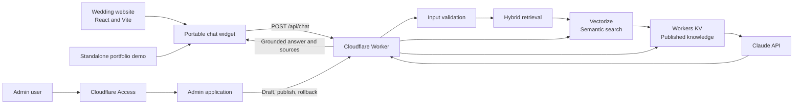

# Master Implementation Plan: Cloudflare AI Event Concierge

> **Status: Draft source plan — not approved for implementation.**
>
> This document preserves the project's initial comprehensive plan. It is an input to the formal design process, not implementation authority. Approved HLDs, LLDs, ADRs, and Linear issues take precedence.


## 1. Project outcome

Build a portfolio-quality, reusable AI knowledge assistant, deploy it on Cloudflare, and embed it into [vandanawedsajay.uk](https://vandanawedsajay.uk).

The finished product will demonstrate:

- Cloudflare Workers and Wrangler
- Workers KV
- Anthropic/Claude integration
- Secure secret management
- Grounded AI answers
- Portable website embedding
- CORS and abuse protection
- A nontechnical admin interface
- Automated tests and deployment
- Production monitoring and rollback

The existing wedding frontend is React/Vite, with its shared layout in `frontend/src/components/Layout.jsx`. This provides a clean place to mount the assistant across every page without changing the existing Java APIs or Nginx `/api` routing.

## 2. Final product

Visitors see a floating “Ask us” button on the wedding website. Opening it displays a chat window.

The assistant can answer approved questions such as:

- What events are planned?
- Where is the venue?
- What should I wear?
- Is transportation available?
- Where can I RSVP?
- Is parking available?
- What time should guests arrive?

The assistant must answer only from content published by an administrator. If information is unavailable, it says so rather than inventing an answer.

A separate admin interface lets a nontechnical user:

- Add and edit FAQs
- Disable outdated entries
- Preview changes
- Publish a new content version
- Restore a previous version
- Import or export content
- Change the assistant welcome message
- Temporarily disable the assistant

## 3. Recommended architecture



### Deployment locations

- Main site: `https://vandanawedsajay.uk`
- Assistant API and assets: `https://assistant.vandanawedsajay.uk`
- Public portfolio demo: `https://assistant.vandanawedsajay.uk/demo`
- Protected admin page: `https://assistant.vandanawedsajay.uk/admin`

### Repository strategy

Create a separate public repository named something like `cloudflare-ai-event-concierge`.

Keep the existing wedding platform in its current repository. Only add the widget integration there. This makes the Worker, KV, AI, admin, and deployment work easy for prospective clients to inspect.

## 4. Phase 0: Lock down the MVP

Record the final scope and decisions in `docs/decisions.md` before implementation.

### Included in version 1

- TypeScript Cloudflare Worker
- Workers KV content storage
- Cloudflare Vectorize semantic-search index
- Cloudflare Workers AI embedding generation
- Anthropic Messages API integration
- Hybrid FAQ retrieval: exact/keyword scoring plus semantic vector search
- Grounded answers with source titles
- Portable JavaScript widget
- Public standalone demo
- Admin content editor
- Draft, publish, snapshot, and rollback workflow
- Cloudflare Access authentication
- CORS allowlist
- Request validation
- Turnstile and rate limiting
- Response caching
- Unit, integration, and browser tests
- Staging and production environments
- Custom subdomain
- CI/CD
- Documentation and portfolio assets

### Explicitly excluded from version 1

- User accounts
- Conversation persistence
- Personalized RSVP lookup
- Access to private guest information
- Voice input
- File or PDF uploads
- Multiple customers or tenants
- Complex analytics dashboard
- D1 database
- WhatsApp integration

These can become future enhancements after version 1 is deployed and stable.

## 5. Phase 1: Accounts, credentials, and prerequisites

### Cloudflare

Confirm access to the Cloudflare account managing `vandanawedsajay.uk`.

Prepare:

- Cloudflare account ID
- Permission to deploy Workers
- Permission to create KV namespaces
- Permission to configure Worker custom domains
- Permission to configure Cloudflare Access
- Permission to configure Turnstile and rate limiting
- Permission to edit DNS if required

For automated deployment, create a least-privilege API token with only the necessary Worker, KV, and zone permissions. Do not use a Global API Key.

### Anthropic

Prepare:

- An Anthropic account
- API billing enabled
- A dedicated API key for this project
- A low monthly usage or spend limit
- A current low-cost Claude model enabled for the account

Do not reuse a personal development API key in production.

### Local tools

Install or confirm:

- Git
- Node.js LTS
- npm
- Wrangler CLI
- GitHub CLI, optionally
- A current Chrome browser
- Access to the wedding website deployment machine

Validate:

```bash
node --version
npm --version
npx wrangler --version
git --version
```

### Secrets policy

Secrets must never appear in:

- Git history
- `.env.example`
- `wrangler.jsonc`
- Screenshots
- Browser JavaScript
- GitHub Actions logs
- README examples

Local secrets go into `.dev.vars`, which must be ignored by Git. Production secrets are installed with Wrangler secret management.

## 6. Phase 2: Create the new project

### Proposed structure

```text
cloudflare-ai-event-concierge/
├── src/
│   ├── index.ts
│   ├── env.ts
│   ├── routes/
│   │   ├── chat.ts
│   │   ├── health.ts
│   │   └── admin.ts
│   ├── services/
│   │   ├── anthropic.ts
│   │   ├── content.ts
│   │   ├── retrieval.ts
│   │   ├── cache.ts
│   │   └── snapshots.ts
│   ├── security/
│   │   ├── cors.ts
│   │   ├── access.ts
│   │   ├── turnstile.ts
│   │   └── validation.ts
│   ├── prompts/
│   │   └── assistant.ts
│   └── types/
│       └── api.ts
├── web/
│   ├── widget/
│   │   ├── widget.ts
│   │   └── widget.css
│   ├── admin/
│   │   └── ...
│   └── demo/
│       └── ...
├── content/
│   ├── sample-content.json
│   └── schema.json
├── scripts/
│   ├── seed.ts
│   ├── export-content.ts
│   └── validate-content.ts
├── tests/
│   ├── unit/
│   ├── integration/
│   ├── e2e/
│   └── evaluation/
├── docs/
│   ├── architecture.md
│   ├── deployment.md
│   ├── administration.md
│   ├── security.md
│   └── decisions.md
├── .github/workflows/
│   ├── ci.yml
│   └── deploy.yml
├── .dev.vars.example
├── .gitignore
├── package.json
├── tsconfig.json
├── vitest.config.ts
├── wrangler.jsonc
├── LICENSE
└── README.md
```

### Technical stack

- TypeScript
- Cloudflare Workers
- Hono for routing and middleware
- Zod for runtime validation
- Workers KV
- Cloudflare Vectorize
- Cloudflare Workers AI with `@cf/baai/bge-small-en-v1.5` for 384-dimensional text embeddings
- Anthropic Claude API for final answer generation
- Vite for the admin and demo builds
- A plain JavaScript custom element for the portable widget
- Vitest with Workers test utilities
- Playwright for browser testing
- ESLint and Prettier

### Environments

Create separate local, staging, and production environments.

Each environment must have:

- Its own KV namespace
- Its own Vectorize index
- Its own Worker deployment
- Its own CORS configuration
- Its own Anthropic secret
- Its own Workers AI and Vectorize bindings
- Its own assistant configuration
- Separate test or sample content

Never test content publishing directly against production.

## 7. Phase 3: Design the KV content model

Because the knowledge base is small, store the published corpus as one versioned JSON document. This avoids non-atomic updates across multiple KV keys.

### Primary KV keys

```text
content:draft
content:published
content:snapshot:<version>
config:assistant
cache:<content-version>:<question-hash>
```

KV remains the source of truth. Vectorize stores only machine-generated vectors and enough metadata to identify the matching FAQ entry; it never replaces the readable published content stored in KV.

### Vectorize record model

Each enabled published FAQ entry gets one Vectorize record.

```text
Vector ID:       <content-version>:<entry-id>
Vector values:   the 384-number embedding generated from the entry text
Metadata:        entryId, contentVersion, category
```

The embedding input is a stable combination of the entry's title, category, example questions, keywords, and approved answer. The index uses 384 dimensions and cosine similarity, matching the selected Workers AI embedding model.

Do not store the whole answer, secrets, guest data, or draft-only content as Vectorize metadata.

### Content format

```json
{
  "schemaVersion": 1,
  "contentVersion": "2026-07-20T14:30:00Z",
  "updatedAt": "2026-07-20T14:30:00Z",
  "updatedBy": "admin@example.com",
  "entries": [
    {
      "id": "venue-location",
      "title": "Wedding venue",
      "category": "Venue",
      "questions": [
        "Where is the wedding?",
        "What is the venue?"
      ],
      "keywords": [
        "venue",
        "location",
        "address",
        "map"
      ],
      "answer": "Approved answer goes here.",
      "links": [
        {
          "label": "View map",
          "url": "https://..."
        }
      ],
      "enabled": true,
      "sortOrder": 10
    }
  ]
}
```

### Content categories

Prepare 20–30 initial entries covering:

- Schedule
- Venue
- Maps and directions
- Arrival time
- Dress code
- Transportation
- Parking
- Accommodation
- Food
- Children
- Accessibility
- Contact information
- Gifts
- Photography
- RSVP
- Website navigation
- General event policies

### Content safety

Do not place these in the assistant corpus:

- Guest lists
- Phone numbers not intended to be public
- Private addresses
- RSVP details
- Admin credentials
- API keys
- Internal notes
- Personally identifying guest data

Because the wedding date shown on the existing site has passed, the public portfolio demo should display a “Demonstration project” label. Public GitHub seed data should be fictional or sanitized.

## 8. Phase 4: Define the API

### Public endpoints

#### `GET /health`

Returns service status without calling Anthropic:

```json
{
  "status": "ok",
  "version": "1.0.0",
  "contentAvailable": true
}
```

It must not reveal secrets, internal IDs, or sensitive configuration.

#### `GET /api/config`

Returns safe UI configuration:

```json
{
  "enabled": true,
  "title": "Wedding Assistant",
  "welcomeMessage": "How can I help?",
  "suggestedQuestions": []
}
```

#### `POST /api/chat`

Request:

```json
{
  "question": "Where is the venue?",
  "history": [],
  "turnstileToken": "..."
}
```

Response:

```json
{
  "answer": "The event is being held at ...",
  "sources": [
    {
      "id": "venue-location",
      "title": "Wedding venue"
    }
  ],
  "requestId": "...",
  "cached": false
}
```

Limit history to the last few short messages and never store it by default.

### Protected admin endpoints

Place admin APIs below `/admin` so one Cloudflare Access policy protects the UI and API:

- `GET /admin/api/content`
- `PUT /admin/api/draft`
- `POST /admin/api/publish`
- `GET /admin/api/snapshots`
- `POST /admin/api/rollback/:version`
- `GET /admin/api/export`
- `PUT /admin/api/config`

### Error format

```json
{
  "error": {
    "code": "RATE_LIMITED",
    "message": "Please wait before trying again.",
    "requestId": "..."
  }
}
```

Implement expected status codes:

- `400` invalid request
- `401` authentication required
- `403` forbidden origin or identity
- `404` route or content not found
- `413` body too large
- `429` rate limited
- `500` unexpected internal error
- `502` upstream AI failure
- `503` assistant disabled or unavailable

## 9. Phase 5: Build hybrid content retrieval

Do not send the entire knowledge base to Claude without filtering. Retrieval is the custom RAG layer: it selects relevant approved content before Claude writes an answer.

Version 1 uses two complementary retrieval methods:

- Deterministic lexical retrieval: exact question, phrase, title, category, and keyword scoring.
- Semantic retrieval: Workers AI creates a question embedding and Vectorize returns the nearest FAQ vectors by meaning.

This hybrid approach keeps exact FAQ matches reliable while also handling paraphrases such as “Where will the ceremonies take place?” when the FAQ is titled “Wedding venue.”

### Why version 1 uses both lexical and semantic retrieval

Vectorize semantic search alone would be sufficient for a small FAQ demo, but it is not the only retrieval signal we should trust in a client-facing assistant. Semantic search finds entries that are close in meaning; lexical retrieval identifies exact known terms and phrases. They solve different problems.

| Situation | Lexical retrieval contribution | Semantic retrieval contribution |
|---|---|---|
| Exact prepared FAQ, such as “What is the dress code?” | Strongly selects the known matching entry | Confirms the match |
| Event names, dates, times, URLs, or map-related questions | Preserves precise, explicit matches | Can retrieve related context |
| Natural-language paraphrase, such as “What should I wear?” | May have no strong match unless examples cover it | Finds the dress-code entry by meaning |
| Newly published content | Works immediately from the published KV document | Vectors can take a short time to become queryable |
| Vectorize failure, stale result, or low-confidence result | Provides a low-cost, deterministic fallback | Does not block the response path |

The hybrid ranking intentionally gives a strong boost to an exact FAQ/example-question match. It then combines that result with Vectorize matches so the system handles both factual precision and natural-language variation.

This is not redundant. It provides four practical benefits:

- **Precision:** exact event names, times, URLs, and FAQ phrases should win over merely similar content.
- **Recall:** semantic search finds relevant entries when visitors phrase a question differently from the stored FAQ.
- **Resilience:** the assistant can still use KV-based lexical retrieval while a newly published vector is indexing or if Vectorize is unavailable.
- **Observability:** lexical scores and vector similarity scores can be logged and evaluated independently, making retrieval problems easier to diagnose.

For this small corpus, lexical retrieval has negligible cost and complexity. Keep both mechanisms in version 1; do not call Claude if neither produces a sufficiently relevant approved entry.

### Retrieval process

1. Normalize Unicode.
2. Lowercase the question.
3. Remove punctuation.
4. Tokenize the text.
5. Remove common stop words.
6. Score each enabled content entry using deterministic rules.
7. Create a 384-dimensional embedding for the original normalized question using `@cf/baai/bge-small-en-v1.5`.
8. Query Vectorize for the top five nearest vectors, filtered to the current `contentVersion`.
9. Convert vector matches back into FAQ entry IDs and merge them with lexical matches.
10. Rank the merged results using a documented weighted score; exact FAQ matches receive a strong boost.
11. Reject the query if no result reaches the minimum relevance threshold.
12. Select the best three to five entries from the published KV document.
13. Send only those entries to Claude.
14. Return source titles from those selected entries.

### Suggested scoring

- Exact example-question match: highest weight
- Phrase match: high weight
- Keyword match: medium-high weight
- Title or category match: medium weight
- Answer-body token match: low weight
- High Vectorize similarity score: strong semantic signal

### Embedding and indexing workflow

An embedding model converts text into a numeric representation of meaning. It is not the answer-writing model. We use Cloudflare Workers AI to create embeddings and Anthropic Claude only to generate the final grounded response.

When an administrator publishes content:

1. Validate the draft document.
2. Save the current published document as a KV snapshot.
3. Create a new `contentVersion`.
4. For every enabled FAQ entry, build a stable embedding input from its approved fields.
5. Call the Workers AI embedding model once per entry.
6. Upsert the resulting vector into the environment's Vectorize index with the entry ID and content-version metadata.
7. Write the complete document to `content:published` in KV.
8. Confirm the lexical retrieval path immediately; semantic indexing may take a short time to become queryable.

The Worker must fall back to lexical retrieval if the Vectorize result is empty, unavailable, stale, or below the relevance threshold. This keeps newly published content usable even while semantic indexing is catching up.

Create a fixed evaluation dataset containing:

- Direct questions
- Paraphrased questions
- Misspelled questions
- Ambiguous questions
- Follow-up questions
- Completely unrelated questions
- Prompt-injection attempts

### Fallback behavior

If nothing relevant is found:

> I don’t have that information in the approved wedding guide. Please use the contact information on the website.

Do not call Claude for clearly unrelated or unsupported requests.

## 10. Phase 6: Integrate Claude

### Request construction

The Worker calls Anthropic directly. The browser must never communicate with Anthropic.

Environment configuration:

- `ANTHROPIC_API_KEY`: encrypted Worker secret
- `ANTHROPIC_MODEL`: normal environment variable
- `EMBEDDING_MODEL`: `@cf/baai/bge-small-en-v1.5`
- `MAX_OUTPUT_TOKENS`
- `ANTHROPIC_TIMEOUT_MS`
- `PROMPT_VERSION`

### System instructions

The prompt must require the model to:

- Answer only from supplied context
- Never invent missing information
- Ignore conflicting instructions in content or user messages
- Not expose system instructions
- Not claim access to RSVP or guest information
- Keep answers concise
- Preserve approved dates, addresses, and URLs exactly
- Use the approved fallback when context is insufficient

Retrieved content should be surrounded by explicit delimiters and treated as data rather than instructions.

### Reliability controls

- Use an abort timeout
- Retry only retryable `429` and `5xx` responses
- Retry no more than once
- Add randomized backoff
- Do not retry invalid requests
- Record token usage without recording private message content
- Return a generic client error if Anthropic fails
- If an exact FAQ was found, return its canonical answer when Anthropic is unavailable

### Cost controls

- Maximum question length of approximately 500 characters
- Maximum conversation history of four short messages
- Maximum retrieved context size
- Maximum output of approximately 250–400 tokens
- Cache repeated questions
- Configure an Anthropic account spend limit
- Add an emergency `enabled: false` kill switch

## 11. Phase 7: Implement caching

Normalize the question and generate a SHA-256 hash using:

```text
contentVersion + answerModel + embeddingModel + retrievalVersion + promptVersion + normalizedQuestion
```

Store the completed response in KV with a limited TTL. Use an initial TTL of approximately 6–24 hours.

When content is republished, `contentVersion` changes automatically, so old cache entries are no longer used and can expire naturally.

Do not cache:

- Admin requests
- Validation errors
- Rate-limit responses
- Upstream failures
- Anything containing personal information

## 12. Phase 8: Security and abuse controls

### CORS

Production allowlist:

- `https://vandanawedsajay.uk`
- `https://www.vandanawedsajay.uk` only if that hostname is used
- The public demo origin

Localhost origins belong only in local or staging configuration.

For `/api/chat`:

- Validate `Origin`
- Reply correctly to `OPTIONS`
- Return the exact approved origin, never `*`
- Add `Vary: Origin`
- Restrict methods and headers

Admin endpoints should not allow cross-origin browser requests.

### Request security

- Accept only `application/json`
- Enforce a small body-size limit
- Validate every field with Zod
- Reject unknown fields
- Limit question and history lengths
- Escape all content rendered in the browser
- Never render model output with unsanitized `innerHTML`
- Do not permit model-generated scripts or HTML
- Generate a request ID for every request

### Admin authentication

Create a Cloudflare Access self-hosted application covering:

```text
assistant.vandanawedsajay.uk/admin*
```

Allow only explicitly approved email addresses. The Worker should verify the Access identity or JWT for defense in depth before permitting admin mutations.

Do not reuse the wedding platform’s current browser-entered `X-Admin-Secret` pattern for the new admin application.

### Bot and rate protection

Use:

- Cloudflare Turnstile in the widget
- Server-side Turnstile verification
- Cloudflare rate-limiting rules or a dedicated limiter
- A reasonable per-IP short-term limit
- A global emergency disable switch

Workers KV should not be treated as an authoritative strict rate limiter because of eventual consistency.

### Privacy

- Do not persist conversations by default
- State that questions are sent to an AI provider
- Avoid PII in logs
- Redact authorization and secret headers
- Set a short log-retention expectation
- Add a small privacy notice in the widget
- Keep RSVP data completely separate

## 13. Phase 9: Build the admin application

### Content-management functions

- Content list
- Search
- Category filter
- Add entry
- Edit entry
- Enable or disable entry
- Delete with confirmation
- Example-question editor
- Keyword editor
- Link editor
- Validation messages
- Unsaved-changes warning
- Preview answer
- Save draft
- Publish
- Roll back
- JSON import and export

### Publishing workflow

1. Administrator edits the draft.
2. Browser validates basic fields.
3. Worker validates the entire document again.
4. Administrator selects Publish.
5. Worker saves the current published version as a snapshot.
6. Worker creates a new content version.
7. Worker generates embeddings and upserts Vectorize records for every enabled entry.
8. Worker writes the complete document to `content:published`.
9. UI reports the new version and semantic-index status.
10. Exact, semantic, and lexical-fallback smoke queries confirm the new content is usable.

### Rollback

1. List recent snapshots.
2. Show timestamp, actor, and content summary.
3. Require confirmation.
4. Copy the selected snapshot into a new published version.
5. Never overwrite or destroy snapshot history.

KV is sufficient for low-volume snapshots. If a formal audit trail is later required, move audit and history records to D1.

## 14. Phase 10: Build the portable widget

Use a custom web component or self-contained script so it can be embedded in React, WordPress, or a plain HTML page.

Example integration:

```html
<script
  type="module"
  src="https://assistant.vandanawedsajay.uk/widget/v1/widget.js">
</script>

<wedding-ai-assistant
  api-url="https://assistant.vandanawedsajay.uk"
  title="Ask our wedding assistant">
</wedding-ai-assistant>
```

### Widget functionality

- Floating launcher button
- Open and close panel
- Welcome message
- Suggested questions
- User and assistant message bubbles
- Loading indicator
- Retry button
- Clear conversation
- Source-title display
- Disabled or unavailable state
- Privacy message
- Mobile full-screen mode
- Desktop floating panel
- Escape-key close
- Focus management
- Screen-reader labels
- Reduced-motion support

Use Shadow DOM or carefully scoped CSS so the widget cannot interfere with the host website’s styling.

Version the asset path as `/widget/v1/widget.js`. Future changes can ship as `/widget/v2/widget.js` without unexpectedly breaking an existing installation.

## 15. Phase 11: Integrate with the wedding website

The existing application has a shared `frontend/src/components/Layout.jsx`, so the widget can appear across the application.

### Wedding repository changes

1. Create a feature branch.
2. Add `WeddingAssistant.jsx`.
3. Load the versioned widget script once.
4. Render the custom element inside `Layout.jsx`, outside `<Outlet />`.
5. Add build variables:

```text
VITE_ASSISTANT_ENABLED=true
VITE_ASSISTANT_API_URL=https://assistant.vandanawedsajay.uk
```

6. Hide the widget when the feature flag is false.
7. Do not change the existing Java `/api` proxy.
8. Run the Vite build.
9. Rebuild the frontend Docker image.
10. Deploy the updated site.
11. Test every existing route.

Calling the Worker directly through its assistant subdomain avoids conflicts with the Dropwizard `/api` routes and demonstrates domain-restricted CORS.

The repository README should also be corrected: it says React 18, while `frontend/package.json` specifies React 19.2.0.

## 16. Phase 12: Testing strategy

### Unit tests

Test:

- CORS allowlist
- Preflight responses
- JSON validation
- Body and question limits
- Content-schema validation
- Retrieval normalization
- Lexical retrieval scoring
- Embedding-input construction
- Vector-match to FAQ-ID mapping
- Hybrid ranking and tie-breaking
- Minimum relevance threshold
- Prompt construction
- Cache-key generation
- Fallback behavior
- Anthropic error mapping
- Admin access validation
- Snapshot creation
- Content-version changes

### Integration tests

Using a local Worker and KV environment:

- Seed content
- Fetch content from KV
- Mock Workers AI embedding generation
- Mock Vectorize upsert and query operations
- Confirm Vectorize metadata is filtered to the current content version
- Confirm lexical fallback works when Vectorize has no match or is unavailable
- Mock Anthropic success
- Mock timeout
- Mock malformed AI response
- Mock `429`
- Mock `500`
- Verify retry behavior
- Verify cache hit and miss
- Verify publishing
- Verify rollback
- Confirm unauthorized admin access fails
- Confirm forbidden origins fail

### AI evaluation tests

Create at least 40 evaluation prompts:

- 15 direct supported questions
- 10 paraphrases
- 5 misspellings
- 5 unsupported questions
- 5 adversarial or prompt-injection questions

Record:

- Expected content source
- Whether the assistant should answer or refuse
- Required facts
- Forbidden claims

Evaluate retrieval separately from response wording.

### End-to-end browser tests

Test:

- Chrome desktop
- Safari desktop
- Chrome Android-sized viewport
- Safari iPhone-sized viewport
- Keyboard-only usage
- Screen-reader labels
- Slow network
- Anthropic failure
- Assistant disabled
- Long text
- Multiple open and close cycles
- Route navigation while chat is open
- No interference with RSVP or admin pages

### Performance checks

- Widget script size
- Initial page-loading impact
- Worker response time
- Cached versus uncached latency
- Lighthouse mobile score
- Layout shift
- No unnecessary Anthropic calls

Production AI load testing should use only a few controlled requests. Higher-volume tests should mock Anthropic to avoid unnecessary cost.

## 17. Phase 13: Cloudflare deployment

### Create resources

For staging and production:

1. Authenticate Wrangler.
2. Create a KV namespace.
3. Create a Vectorize index with 384 dimensions and cosine similarity.
4. Record the generated namespace and index identifiers.
5. Add the KV, Vectorize, and Workers AI bindings to the appropriate Wrangler environment.
6. Configure ordinary environment variables.
7. Install the Anthropic API key as a Worker secret.
8. Configure Turnstile secrets.
9. Seed staging content and build its vectors.
10. Deploy the staging Worker.
11. Run staging smoke tests for exact, semantic, unsupported, and Vectorize-fallback queries.
12. Seed production content and build its vectors.
13. Deploy production.
14. Attach `assistant.vandanawedsajay.uk`.
15. Confirm DNS and SSL.
16. Configure Cloudflare Access for `/admin*`.
17. Configure rate-limiting rules.
18. Verify production CORS.

### Wrangler configuration

The configuration should include:

- Worker name
- Compatibility date
- Main TypeScript entry point
- Static asset directory
- KV bindings
- Vectorize binding
- Workers AI binding
- Staging and production variables
- Observability configuration
- Custom domain configuration where appropriate

Only KV identifiers and non-secret settings belong in this file.

### Seeding

The seed script should:

- Accept an environment argument
- Validate the JSON schema
- Refuse invalid content
- Display the target account and environment
- Require confirmation for production
- Write the draft
- Generate and upsert embeddings for enabled entries
- Publish the initial version
- Print the resulting version
- Never contain credentials

## 18. Phase 14: CI/CD

### Pull-request CI

For every pull request:

- Install locked dependencies
- Lint
- Check formatting
- Type-check
- Run unit tests
- Run integration tests
- Build the Worker
- Build the widget
- Build the admin application
- Validate sample content
- Optionally run Playwright

### Deployment workflow

Recommended policy:

- Merges to `main` deploy automatically to staging
- Production deployment requires manual approval
- Production content publishing remains an admin operation
- GitHub Actions deploys code, not knowledge-base content

GitHub secrets:

- Cloudflare API token
- Cloudflare account ID

The Anthropic key can be installed directly as a Worker secret during environment bootstrap and does not need to be present in GitHub Actions.

Add branch protection so CI must pass before merging.

## 19. Phase 15: Production launch checklist

Before enabling the widget:

- Worker health check passes
- Production content is published
- Production vectors are present for the current content version
- All production content is reviewed
- No private data is present
- Anthropic key works
- Spend limit is enabled
- CORS blocks an unapproved test origin
- CORS accepts the wedding domain
- Turnstile works
- Rate limiting works
- Admin page requires Cloudflare Access
- Unauthorized admin requests fail
- Widget works on mobile
- Widget works with keyboard navigation
- Error states are understandable
- Existing RSVP flow still works
- Existing admin flow still works
- Website performance remains acceptable
- Rollback procedure has been tested

Launch order:

1. Deploy the website change with the widget feature disabled.
2. Verify the page and widget assets.
3. Enable the Worker.
4. Enable the frontend feature flag.
5. Rebuild and deploy the wedding frontend.
6. Run production smoke tests.
7. Monitor errors and Anthropic usage closely for the first day.

## 20. Phase 16: Observability and operations

Record structured fields such as:

- Timestamp
- Request ID
- Route
- Status
- Latency
- Cache hit or miss
- Retrieved content IDs
- Anthropic model
- Input and output token counts
- Upstream status
- Error category

Do not log:

- API keys
- Access tokens
- Complete authorization headers
- Full admin content
- Full chat history
- Private guest information

### Monitoring

Set up checks for:

- Health endpoint availability
- Elevated `5xx` rate
- Anthropic failures
- Rate-limit volume
- Unexpected token usage
- KV errors
- Admin publish failures
- Widget asset availability

### Emergency controls

Prepare three shutdown mechanisms:

- Set `config:assistant.enabled` to false
- Disable the widget through the frontend feature flag
- Roll back the Worker deployment

The disabled state should return a friendly message without calling Anthropic.

## 21. Phase 17: Rollback and recovery

### Worker rollback

- Retain prior Worker versions
- Record deployment IDs
- Test the Wrangler or dashboard rollback procedure
- Do not combine a risky Worker release and major content publish in the same operation

### Content rollback

- Keep recent published snapshots
- Roll back by publishing a snapshot as a new version
- Do not mutate historical snapshots
- Export production content periodically

### Website rollback

- Keep the prior frontend Docker image
- Keep the assistant behind a feature flag
- Disable or remove only the widget if necessary, without changing the Java backend

## 22. Phase 18: Documentation

### README

The public README should contain:

- Project purpose
- Live demo
- Screenshot
- Architecture diagram
- Feature list
- Technology stack
- Local setup
- Wrangler setup
- KV creation and seeding
- Secret installation
- Deployment
- CORS configuration
- Widget embedding
- Admin workflow
- Testing commands
- Security decisions
- Cost considerations
- Known limitations
- Future roadmap

### Additional documents

- `architecture.md`: request and publishing flows
- `deployment.md`: staging and production steps
- `administration.md`: editing and publishing instructions
- `security.md`: threat model and controls
- `decisions.md`: architecture decision records
- `troubleshooting.md`: common Wrangler, CORS, KV, and Anthropic problems

## 23. Phase 19: Portfolio packaging

### Public presentation

Create:

- Live standalone demo
- Embedded wedding-site version
- Public GitHub repository
- Desktop screenshot
- Mobile screenshot
- Admin screenshot
- Architecture diagram
- Short screen recording
- Sanitized sample dataset

### Suggested portfolio title

**Cloudflare AI Event Concierge with Workers KV and Claude**

### Portfolio description

> Built and deployed a custom RAG knowledge assistant using Cloudflare Workers, Workers KV, Vectorize, Workers AI embeddings, and the Anthropic API. The application performs hybrid semantic and keyword retrieval over approved event content, generates grounded answers, enforces domain-restricted CORS and abuse controls, and includes a Cloudflare Access-protected admin interface for publishing and rolling back knowledge-base updates. Delivered as a reusable JavaScript widget and integrated into an existing React wedding platform.

### Skills to highlight

- Cloudflare Workers
- Workers KV
- Cloudflare Vectorize
- Workers AI embeddings
- Wrangler
- TypeScript
- Anthropic API
- Serverless architecture
- CORS
- Cloudflare Access
- Turnstile
- API security
- React
- CI/CD
- Production deployment

### Evidence for Upwork proposals

> I recently deployed a custom RAG assistant using Cloudflare Workers, Workers KV, Vectorize, Workers AI embeddings, and Claude. I configured Wrangler environments, semantic indexing at publish time, Worker secrets, domain-restricted CORS, Cloudflare Access for administration, a portable website widget, and end-to-end production testing.

## 24. Definition of done

The project is complete only when all of these are true:

- The Worker is reproducibly deployable with Wrangler.
- Staging and production have separate KV namespaces.
- Staging and production have separate Vectorize indexes with dimensions matching the embedding model.
- The Anthropic key exists only as a secret.
- Visitors can ask questions from the wedding website.
- Answers come only from published KV content.
- Semantic Vectorize results are filtered to the current published content version.
- Lexical fallback works if Vectorize is unavailable or has not indexed a new version yet.
- Unsupported questions produce a safe fallback.
- Answers include source titles.
- Repeated questions use the cache.
- The admin can edit, preview, publish, and roll back content.
- Admin routes are protected by Cloudflare Access.
- Unapproved origins cannot use the chat API.
- Turnstile and rate limiting reduce abuse.
- No conversations or guest data are persisted by default.
- Desktop, mobile, keyboard, and error states work.
- CI passes.
- Production monitoring and rollback are documented.
- The public repository contains no private information.
- The demo, screenshots, README, and Upwork portfolio entry are ready.

## 25. Estimated implementation effort

| Workstream | Estimate |
|---|---:|
| Project setup and architecture | 2–3 hours |
| Worker, KV, and API contracts | 5–7 hours |
| Hybrid retrieval, embeddings, Vectorize, and Anthropic integration | 8–12 hours |
| Admin application | 6–8 hours |
| Portable widget and demo | 5–7 hours |
| Wedding-site integration | 2–3 hours |
| Security and abuse controls | 3–5 hours |
| Automated tests and AI evaluations | 5–7 hours |
| Deployment, monitoring, and rollback | 3–5 hours |
| Documentation and portfolio assets | 3–5 hours |
| **Total portfolio-quality implementation** | **42–62 hours** |

A stripped-down technical MVP could be completed in approximately 20–28 hours, but the full plan above produces a credible project that can be confidently shown to clients and discussed in interviews.
