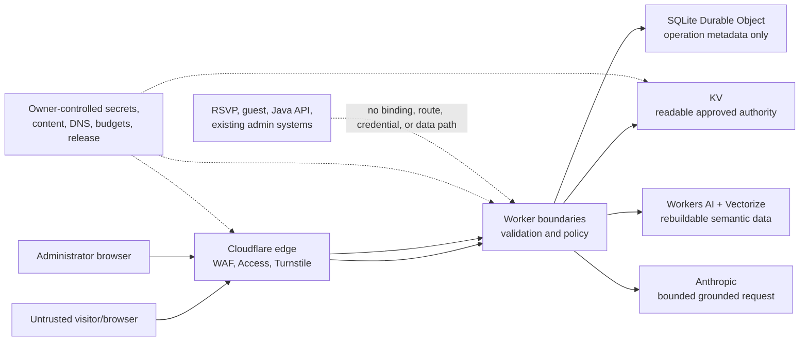

# Security, Privacy, and Threat Model

Status: Proposed for owner approval under [AJA-7](https://linear.app/ajayd94/issue/AJA-7/seed-34-produce-the-detailed-design-and-assurance-package)

## Security objectives

1. Only current administrator-approved public content can ground an answer.
2. Public abuse cannot bypass bounded work or silently create unbounded spend.
3. Only an Access-authenticated and application-allowlisted administrator can
   read or mutate admin state.
4. Browser origins, caller data, retrieved content, model output, vector
   metadata, cache entries, and provider responses are untrusted until
   validated.
5. Secrets and private wedding/guest systems remain outside the application.
6. Operational evidence is useful without becoming a conversation or identity
   store.
7. Production content, credentials, trust settings, deployment, rollback,
   pause, and decommission remain human-controlled.

This is a portfolio demonstration using fictional or sanitized public content.
It is not a private wedding service, user account system, or source of
personalized RSVP information.

## Data and trust boundaries



| Boundary | Data allowed across | Data prohibited |
|---|---|---|
| Browser -> public Worker | Bounded question/history, client UUID, fresh Turnstile token, Origin | Credentials, file upload, private guest lookup |
| Browser -> admin Worker | Access assertion added by edge, validated content mutations, ETags/idempotency | Caller-supplied actor/status/version authority |
| Worker -> KV | Complete validated content/config/status values | Chat history, Turnstile tokens, provider secrets |
| Worker -> Vectorize | Embeddings, deterministic ID/namespace, minimal metadata | Answer text, links, actor, guest/private data |
| Worker -> Anthropic | Bounded untrusted question/history and at most four approved entries | Secrets, full corpus, private systems/data |
| Worker -> logs | Approved metadata allowlist | Raw questions/answers/history, tokens, JWTs, email, IP, secrets, full documents |
| Automation -> production | Reviewed artifact proposals/evidence only | Secrets, deploy, publish, DNS, billing, rollback, merge |

## Threat actors and assets

Threat actors include an unauthenticated visitor, abusive bot, malicious site
embedding the widget, compromised/unauthorized admin identity, authorized but
mistaken administrator, prompt/content injector, dependency/provider
compromise, leaked credential holder, and an agent/CI process operating outside
authority.

Protected assets are production content integrity/availability, admin
authority, Anthropic/Cloudflare spend, secret material, Access identity,
fictional/sanitized public boundary, retrieval/prompt policy, deployment
integrity, backups, and credible portfolio evidence.

## Threat register

| ID | Threat | Control and evidence | Residual/response |
|---|---|---|---|
| TM-01 | Forged or replayed Access assertion | Validate `Cf-Access-Jwt-Assertion` RS256 signature, exact issuer, audience, expiry/nbf, subject, cached JWKS; app allowlist | JWKS outage denies admin; follow provider-outage runbook |
| TM-02 | Access policy admits unintended identity | Independent subject/email allowlist; actor derived from validated `sub`; negative tests | Owner reviews both layers and rotates policy |
| TM-03 | CSRF/cross-origin admin mutation | Admin has no CORS; exact Worker `Origin` required for mutations; `Sec-Fetch-Site` same-origin when present; confirmations/ETags/idempotency | Same-origin compromise remains; CSP/XSS controls reduce it |
| TM-04 | Public cross-origin API abuse | Exact per-environment allowlist, exact reflection, no credentials, `Vary: Origin`, restricted preflight | Non-browser clients can omit browser CORS; abuse controls remain |
| TM-05 | Oversized/malformed input | Early byte limit, one JSON parse, closed Zod schemas, Unicode/control validation | Rejection before expensive services |
| TM-06 | Turnstile forgery/replay | Mandatory Siteverify, secret server-side, exact hostname/action, 300-second/single-use, reset every attempt, safe validation idempotency | Provider outage returns recoverable unavailable |
| TM-07 | Rate-limit evasion/shared-IP harm | WAF burst rule plus app binding; daily HMAC transient IP+colo key; friendly retry; no persistent fingerprint | Approximate/local behavior documented; spend controls independent |
| TM-08 | Denial of wallet | Request/context/output/deadline bounds, canonical/fallback no-Claude paths, cache, dual rate control, Free-plan hard failures, Anthropic limit/alerts, runtime disable | Owner follows unexpected-spend runbook; no automatic Paid upgrade |
| TM-09 | User prompt injection | Relevance gate before Claude; explicit untrusted delimiters; system policy; no tools/actions/private path | Injection evaluation must pass 100% |
| TM-10 | Stored content injection | Runtime content schema, human approval, same untrusted delimiters, text rendering, approved links only | Admin compromise can publish bad facts; snapshots/rollback and owner review |
| TM-11 | Model HTML/XSS/link injection | Plain-text response validation/rendering; no `innerHTML`; links constructed only from KV with HTTPS/host/rel policy | Model text may display markup literally, never execute |
| TM-12 | Stored XSS in admin/widget | Plain-text fields, HTML/control rejection, React safe binding, Shadow DOM, CSP, browser tests | Dependency/UI bug handled as security incident |
| TM-13 | Vector poisoning/stale cross-version use | Version namespace/ID/metadata checks; KV resolution; status must be ready; rebuildable index | Any mismatch degrades lexical and triggers repair |
| TM-14 | Cache poisoning/privacy | Synthetic hashed GET key, version inputs, response schema/ETag, personal-info exclusions, no raw question, no error/auth caching | Cache loss/invalid entry becomes miss |
| TM-15 | Draft lost update | Strong ETag plus serialized coordinator admission | Conflict requires human reconciliation |
| TM-16 | Duplicate/conflicting publish | SQLite coordinator journal, request hash, seven-day idempotency, deterministic side effects/checkpoints | Cross-service operation is saga; recovery tests at every checkpoint |
| TM-17 | Snapshot mutation/history rewrite | Create-or-verify immutable keys/hash; rollback creates new ULID | KV/operator authority could overwrite; backup/integrity review detects |
| TM-18 | Secret exposure | No secrets in Git/browser/examples/logs; `.dev.vars` ignored; Worker secrets; least privilege; scanning/rotation runbook | Owner rotates on suspected exposure |
| TM-19 | Sensitive telemetry | Typed allowlist, recursive prohibited-field tests, 10% public success sample, <=7-day target | Cloudflare actual retention must be verified before launch |
| TM-20 | Private wedding integration | No binding/route/credential/schema; contract and repository review | Feature expansion requires new approved design |
| TM-21 | Supply-chain compromise | Lockfile, pinned direct dependencies, audit reporting, Dependabot review, no auto-upgrade, CSP | Zero-day response requires human-reviewed patch |
| TM-22 | Route/static fallback confusion | API precedence, prefix-specific 404, Access on `/admin*`, contract tests | One Worker has shared blast radius; rollback/feature flags contain |
| TM-23 | Environment crossover | Separate every resource/secret/origin/cache/content/DO namespace; parity checks | Human dashboard misconfiguration remains; release checklist detects |
| TM-24 | Agent/CI exceeds authority | Scoped credentials, no cloud/model production secrets, Linear gates, human merge/deploy/rollback, review packet | Trusted-host runner risk is accepted in ADR-0001 |
| TM-25 | Backup loss/exposure | Owner-controlled encrypted backup outside repo, restore test, no visitor data | Owner chooses storage/retention; absence blocks launch |
| TM-26 | Denial of service/provider outage | Best-effort posture, lexical fallback, no-AI health, friendly unavailable, three kill switches | No uptime SLA; owner may pause |

## Access JWT validation

Admin middleware:

1. require a single `Cf-Access-Jwt-Assertion` header;
2. parse header/payload only to select `kid`; reject malformed or oversized
   tokens before network work;
3. permit only `RS256`;
4. load JWKS from exact
   `<ACCESS_ISSUER>/cdn-cgi/access/certs` with HTTPS;
5. cache successful keys for at most one hour and respect shorter provider cache
   directives; on unknown `kid`, refresh once;
6. verify signature, exact issuer, configured audience membership, `exp`,
   optional `nbf`, and nonempty string `sub`, with at most 60 seconds clock
   tolerance;
7. reject a token issued in the implausible future or with an unsupported claim
   type;
8. require the subject or owner-approved email claim in the application
   allowlist; and
9. derive `actorRef` from `sub`, then discard the token/identity fields.

If JWKS cannot be refreshed, only a still-valid cached matching key may be used.
Unknown keys or expired cache fail closed. Neither JWT nor email appears in
errors or logs.

## CORS and CSRF

Public allowed origins are exact normalized origins with HTTPS, no path/query,
and default-port normalization. Production initially contains the assistant
demo origin and canonical wedding origin. `www` is absent unless the owner
verifies it. Localhost exists only in local/staging reviewed configuration.
Wildcard, suffix matching, regex, `null`, file, extension, and userinfo origins
are prohibited.

Preflight validates requested method/headers and reflects only the exact allowed
origin. It never invokes Turnstile, KV, rate binding, cache, or AI.

Admin routes do not emit cross-origin CORS. Mutations require the exact Worker
origin even though Access already authenticates. SameSite behavior is
defense-in-depth, not the sole CSRF control. GETs remain non-mutating and
`Cache-Control: no-store`.

## Turnstile lifecycle

- A fresh managed/invisible token is obtained for each send.
- Token length is at most 2,048; it is never stored or logged.
- Siteverify uses the environment secret, response token, expected hostname,
  and exact action `chat`. `remoteip` is omitted.
- The server uses a UUID validation idempotency key derived independently from
  the client request ID so one short network retry is safe.
- Tokens are accepted only on `success=true`, matching hostname/action, and
  challenge timestamp within the provider's five-minute validity.
- Any outcome resets the widget. `timeout-or-duplicate` prompts a fresh token.
- Retrieval/cache/model work begins only after success.

## Abuse and denial-of-wallet controls

The Worker derives the application rate key without retaining IP:

```text
base64url(HMAC-SHA-256(
  RATE_KEY_SECRET,
  "rate:v1\n" + UTC_DATE + "\n" + cf.colo + "\n" + CF_CONNECTING_IP
))
```

Only Cloudflare-provided request metadata is trusted. The daily key prevents
long-term linking and is never logged. Initial application control is 10 chat
requests/minute/key/location; WAF is 5 requests/10 seconds on chat. These are
approximate controls, not strict global user accounting.

Additional bounds:

- body 16 KiB, question 500 characters, history four messages/2,000 total;
- semantic top 8, context four entries/12 KiB;
- output 300 tokens; 15-second request deadline and one bounded retry;
- unsupported, exact, and no-AI health paths avoid Claude;
- internal Cache API for eligible responses;
- Anthropic owner-configured $5 initial limit/alert and notification thresholds
  where supported;
- Cloudflare Free-only hard boundary and usage review;
- independent runtime disable, wedding feature flag, and Worker rollback.

No control automatically upgrades Workers or raises a provider budget.

## Browser, rendering, link, and header policy

Content/model text is assigned to text nodes or framework text bindings. Raw
`innerHTML`, `dangerouslySetInnerHTML`, model Markdown/HTML renderers, and
model-created links are prohibited.

Approved URLs must be HTTPS, credential-free, bounded, and on the configured
host allowlist. Render external links with `rel="noopener noreferrer external"`
and `referrerpolicy="no-referrer"`; new tabs use a nonempty accessible label.

Baseline headers:

| Surface | Required policy |
|---|---|
| Admin SPA | `default-src 'self'`; scripts/styles from self plus the minimum Turnstile origin if used; `connect-src 'self'`; `object-src 'none'`; `base-uri 'none'`; `form-action 'self'`; `frame-ancestors 'none'` |
| Demo | Self-only by default, explicit Turnstile script/frame/connect origins, `frame-ancestors 'self'` |
| Widget asset | Immutable cache, `nosniff`, `Cross-Origin-Resource-Policy: cross-origin`; no Access |
| JSON APIs | `nosniff`, `Referrer-Policy: no-referrer`, restrictive `Permissions-Policy`; no framing meaning |

All HTML surfaces also set HSTS through the Cloudflare zone after human
verification. CSP must use explicit origins/nonces or hashes; `unsafe-eval` is
prohibited. Any unavoidable `unsafe-inline` requires a reviewed ADR and must not
be inferred from framework convenience.

## Secret and configuration policy

| Value | Storage | Owner action |
|---|---|---|
| Anthropic key | Worker secret, environment-specific | Create/install/rotate |
| Turnstile secret | Worker secret, environment-specific | Create/install/rotate |
| Rate-key secret | Worker secret, environment-specific | Generate/install/rotate |
| Cloudflare deploy token | Human/GitHub environment secret, least privilege | Create/rotate |
| Access issuer/audience/admin allowlist | Reviewed non-secret environment config | Supply/approve |
| Sitekey/origins/resource IDs | Reviewed non-secret config | Supply/verify |

Local secrets use ignored `.dev.vars`. Secret names may appear in schemas;
values never appear in Git, examples, issue comments, PRs, screenshots, logs, or
browser bundles. A suspected exposure triggers
[secret rotation](runbooks/secret-rotation.md) and incident review; do not wait
for confirmation.

## Privacy and logging

The application does not persist conversations by default. Browser history is
memory-only and clears on reload or explicit clear. Questions/history may be
sent to Workers AI and Anthropic only as needed; the point-of-use notice tells
visitors not to include personal information.

Prohibited telemetry fields at every nesting level:

- raw/normalized question, answer, history, prompt, context, complete content;
- Turnstile token/secret, JWT/cookie, email, IP, API key, authorization header;
- guest/RSVP data, private address/phone, provider raw body, embedding values.

Allowed metadata is enumerated in `detailed-design.md`. Successful public logs
are deterministically sampled at 10%; errors/admin mutations are kept. Target
retention is at most seven days where Cloudflare supports it. Before launch, the
owner records actual Cloudflare and Anthropic retention/configuration so privacy
copy does not overpromise.

Cache policy also excludes likely personal information in question or output.
The detector is a storage-minimization control, not a reason to log or classify
the matching text.

## Security verification and release blockers

Production is blocked by any:

- failed Access, origin, injection, critical-fact, content/version, cache, or
  coordinator test;
- private/secret data in public artifacts;
- absent exact CORS, Turnstile, WAF/rate, provider budget, runtime disable, or
  backup/rollback control;
- unknown provider retention or misleading privacy copy;
- unresolved high/critical dependency finding;
- environment resource crossover; or
- required control no longer available within the approved Free-only boundary.

Only the owner can accept design, production content, residual risk, trust
changes, release, rollback, pause, or decommission. An agent cannot downgrade a
security requirement to keep work moving.
